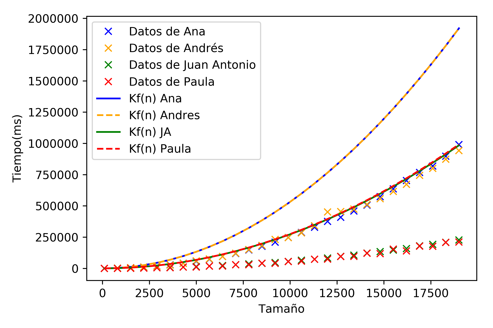

# Presentación grupal

Autores:

> Ana Buendía, Andrés Millán, Paula Villanueva, Juan Antonio Villegas

---

## Objetivos

- Solución teórica de los algoritmos 4, 5 y 6 (no existe el 6)
- Comparación eficiencia empírica e híbrida de 4 y 5
- Puesta en común de diferentes algoritmos

---

## Especificaciones

| Persona      | CPU               | OS                    |
|--------------|-------------------|-----------------------|
| Ana          | i5-6200U 2.30GHz  | Ubuntu 16.04 LTS      |
| Andrés       | i5-8250U 3.40GHz  | Antergos 4-19.29 LTS  |
| Paula        | i7-5600U 2.60GHz  | Ubuntu 18.04 LTS      |
| Juan Antonio | i7-4500U 3.00GHz  | Ubuntu 18.04 LTS      |

---

## Algoritmo 4

#### BuscarBinario

```txt
             |_|_|_|_|_|_|_|_|_|_|_|
------|      ^         ^          ^
Iter 1|  inicio       centro       final
------|      ^    ^    ^
Iter 2|  inicio   c    fin
------|
```

Decrece en $n/2$
<p class="fragment fade-up">
    $T(n) = T(n/2)+a$
</p>
---

Cambio de variable $n = 2^k$

$$T(2^k) = a + T(2^{k-1})$$
$$T(2^{k-1}) = a + T(2^{k-2})$$
...
$$T(2^k) = a \cdot k + 1$$

Deshaciendo el cambio de variable, obtenemos

$$T(n) = a \cdot log_2(n) + 1$$

---

**BuscarBinario** es $O(log_2(n))$

---

##### Comparativa empírica BuscarBinario


---

#### Comparativa híbrida


---

### Constantes BuscarBinario

| Persona      | K             |
| ------------ | :------------ |
| Ana          | 34.785220119  |
| Andrés       | 28.9263485708 |
| Juan Antonio | 35.1166541442 |
| Paula        | 34.8506188855 |

---

## Algoritmo 5

#### Heapsort

---

#### Análisis teórico

- Se realiza la llamada a la función reajustar $n/2 + 1$ veces.
- En `reajustar`, se llama como máximo al bucle $log_2(n) - a$
$$\Downarrow$$
- Eficiencia es $(n/2 + 1)(alog_2(n)-a)$

---

#### Análisis teórico

- Bucle central se ejecuta $n-1$ veces

<p class="fragment fade-up">
    Por tanto, tenemos que
</p>

<p class="fragment fade-up">
    $$a(n-1)(log_2(n)-1) + b(n-1) \in O(nlog_2(n))$$
</p>

---

##### Comparativa empírica heapsort


---


##### Comparativa híbrida heapsort


---

### Constantes heapsort

| Persona      | K               |
| ------------ | :-------------- |
| Ana          | 0.0182624864036 |
| Andrés       | 0.0141484097962 |
| Juan Antonio | 0.0164563064296 |
| Paula        | 0.0176604264123 |

---

## Hanoi

---

##### Comparativa empírica Hanoi


---

## Burbuja

---

##### Comparativa empírica burbuja


---


---

#### Comparativa híbrida burbuja




---

### Constantes burbuja

| Persona      | K                |
| ------------ | :--------------- |
| Ana          | 0.00274223536473 |
| Andrés       | 0.00533          |
| Juan Antonio | 0.00272666666667 |
| Paula        | 0.00274666666667 |

---

## Mergesort

---

##### Comparativa empírica


---

##### Comparativa híbrida


---

### Constantes mergesort

| Persona      | K               |
| ------------ | :-------------- |
| Ana          | 0.0257882362952 |
| Andrés       | 0.0229786230024 |
| Juan Antonio | 0.0213731296921 |
| Paula        | 0.0252865196358 |

---

## Comparativa burbuja y mergesort

<p class="fragment fade-up">
    $$Burbuja \in O(n^2)$$

    $$Mergesort \in O(n + nlog_2(n)) \sim O(nlog_2(n))$$
</p>

---

###### Comparativa empírica burbuja y mergesort


---

<p class="fragment fade-up">
    Coinciden los modelos teóricos y empíricos
</p>