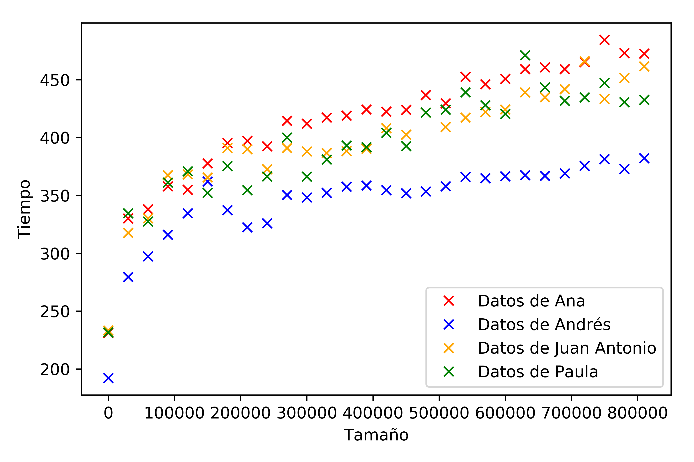
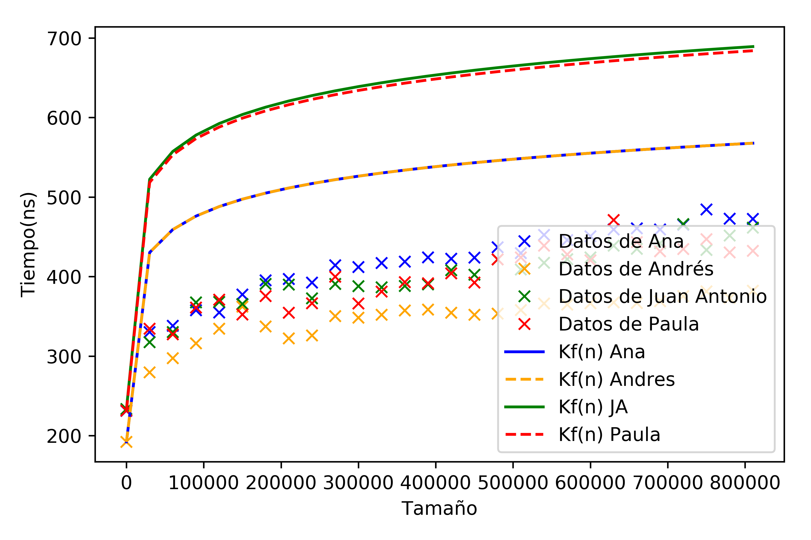
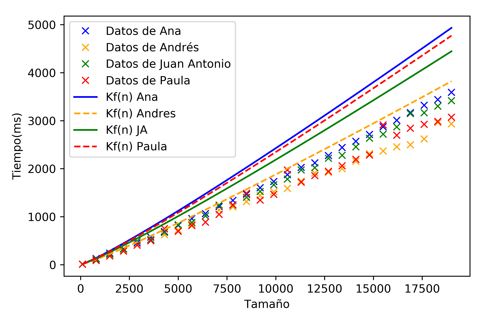
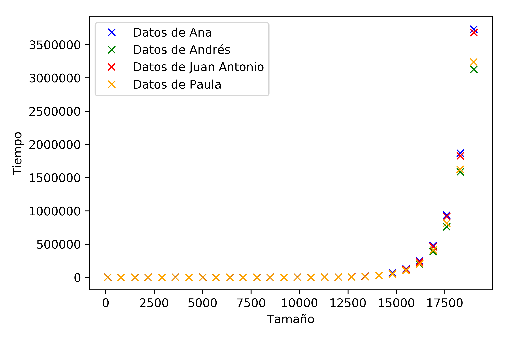
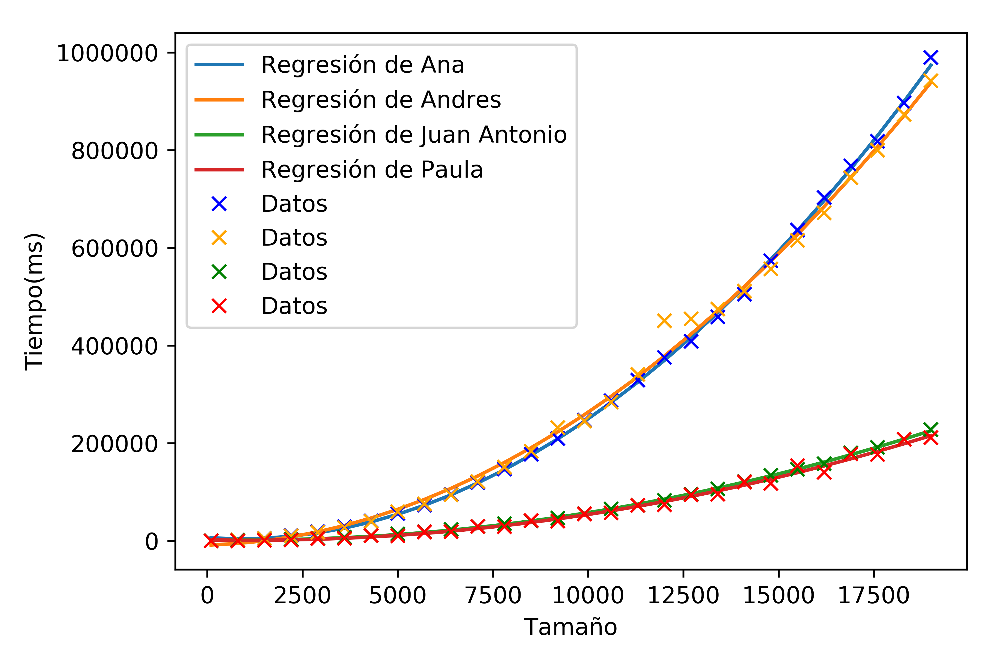
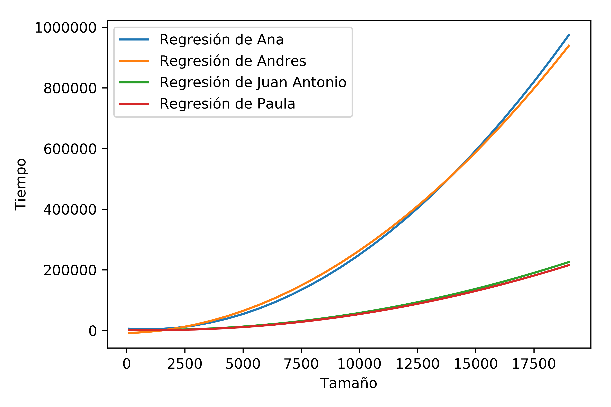
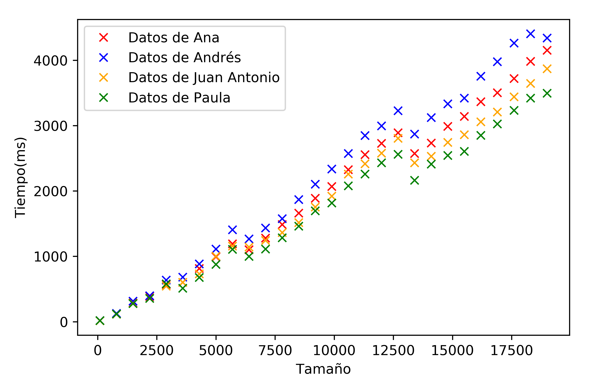
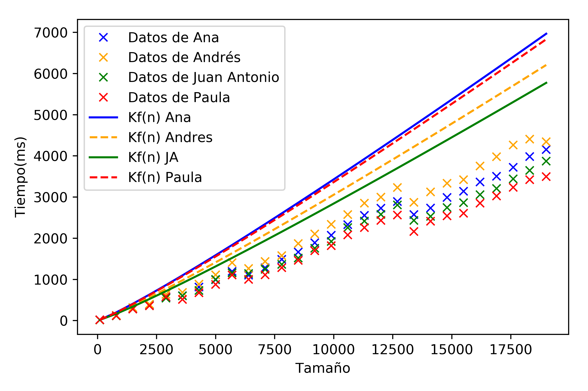

# Algorítmica

# Práctica 1. Análisis de Eficiencia de Algoritmos

## Presentación

> Autores: Ana Buendía Ruiz Azuaga, Andrés Millán Muñoz, Paula Villanueva Núñez, Juan Antonio Villegas Recio.

> 2º doble grado ingeniería informática y matemáticas (2018-19).


#### Introducción

En este documento recogeremos los datos de nuestras partes individuales y los compararemos. Asimismo, haremos un análisis completo de los algoritmos de búsqueda binaria, ordenación por `heapsort` y ordenación por `mergesort`, estudiando los diferentes efectos que producen en una máquina específica.

## Especificaciones

La información sobre el ordenador de cada integrante del grupo se recoge en la siguiente tabla.

| Persona      | CPU               | OS                    |
|--------------|-------------------|-----------------------|
| Ana          | i5-6200U 2.30GHz  | Ubuntu 16.04 LTS      |
| Andrés       | i5-8250U 3.4GHz   | Antergos 4-19.29 LTS  |
| Paula        | i7-5600U 2.60GHz  | Ubuntu 18.04 LTS      |
| Juan Antonio | i7-4500U 3.00GHz  | Ubuntu 18.04 LTS      |

$\pagebreak$

## Algoritmo 4 - BuscarBinario

Consiste en encontrar la posición de un elemento en un vector ordenado.  Compara el valor con el elemento en el medio del array, si no son iguales, la mitad en la cual el valor no puede estar es eliminada y la búsqueda continúa en la mitad restante hasta que el valor se encuentre.

#### Código del programa

```c++
    int BuscarBinario (int *v, const int ini, const int fin, const double x){
        int centro;

        if (ini > fin)
            return -1;

        centro = (ini + fin)/2;

        if (v[centro] == x)
            return centro;
        if (v[centro] > x)
            return BuscarBinario(v, ini, centro-1, x);

        return BuscarBinario (v, centro+1, fin, x);
    }
```

### Eficiencia teórica

Observamos que llamamos recursivamente a la función. Nuestro problema decrece en $\frac{n}{2}$ por cada llamada que hacemos a la función:

```
             |_|_|_|_|_|_|_|_|_|_|_|
------|      ^         ^          ^
Iter 1|  inicio       centro       final
------|      ^    ^    ^
Iter 2|  inicio   c    fin
------|
```

Definimos $T(n) = T(\frac{n}{2})+a$, donde $a$ es la constante asociada a las operaciones elementales. Hacemos un cambio de variable $n = 2^k$. Se tiene entonces
$$T(2^k) = a + T(2^{k-1}) \\ T(2^{k-1}) = a + T(2^{k-2})
\\...\\
T(2^k) = a \cdot k + 1$$
Deshaciendo el cambio de variable, obtenemos
$$T(n) = a \cdot \log_2(n) + 1$$

Por tanto, concluimos que la eficiencia teórica de `BuscarBinario` es $O(\log_2(n))$.

### Eficiencia empírica

Para calcular la eficiencia empírica, cada miembro del grupo ha ejecutado el siguiente script en su ordenador:

```bash
#!/bin/bash
N=100
for j in {1..28}; do
    for i in {1..1000}; do
        ./BuscarBinario $N >> resultados_buscarBinario.dat
    done

    N=$(($N+30000))
done
```

Es decir, hemos ejecutado el algoritmo para 28 tamaños diferentes, ejecutando el algoritmo 1000 veces para cada tamaño. El script producía un fichero de datos con el cual para cada tamaño se calculaba la media de los tiempos de ejecución, obteniendo así un tiempo medio de ejecución para cada tamaño.

Los vectores estaban compuestos por números aleatorios positivos y en todos los casos se buscaba un número negativo, por lo que siempre se ejecutaba el peor de los casos.

Tras los diferentes tests en nuestras respectivas máquinas, hemos obtenido los siguientes resultados:

<p>

</p>

Cabe destacar que en este caso las medidas están en nanosegundos (*ns*).

Comprobamos que la nube de puntos de cada uno se asemeja a una curva logarítmica y que el PC más rápido con este algoritmo es el de Andrés, tardando unos 380ns como máximo.

### Eficiencia híbrida

Hemos calculado la constante *K* para todos los conjuntos de datos empíricos de cada componente del grupo, obteniendo así los siguientes resultados:

| Persona      | *K*             |
| ------------ | :------------ |
| Ana          | 34.785220119  |
| Andrés       | 28.9263485708 |
| Juan Antonio | 35.1166541442 |
| Paula        | 34.8506188855 |

<p>

</p>

$\pagebreak$

## Algoritmo 5 - Heapsort

Este algoritmo consiste en almacenar todos los elementos del vector a ordenar en un montículo (*heap*), y luego extraer el nodo que queda como nodo raíz del montículo (cima) en sucesivas iteraciones obteniendo el conjunto ordenado. Además, basa su funcionamiento en una propiedad de los montículos, por la cual, la cima contiene siempre el menor elemento (o el mayor, según se haya definido el montículo) de todos los almacenados en él.

#### Código del programa:

```c++
void reajustar (int T[], int num_elem, int k) {
    int j, v;
    bool esAPO = false;
    v = T[k];

    while ( (k < num_elem/2) && !esAPO ) {
        j = k + k + 1;

        if ( j < (num_elem - 1) && T[j] < T[j+1] )
            j++;

        if (v >= T[j])
            esAPO = true;

        T[k] = T[j];
        k = j;
    }

    T[k] = v;
}

void heapsort (int T[], int num_elem) {
    int i;

    for (i = num_elem/2; i >= 0; i--)
        reajustar(T, num_elem, i);

    for (i = num_elem - 1; i >= 1; i--) {
        int aux = T[0];
        T[0] = T[i];
        T[i] = aux;
        reajustar(T, i, 0);
    }
}
```

### Eficiencia teórica

Primero estudiaremos la eficiencia de `reajustar`. En cada iteración, la variable `k` se multiplica por 2.

En el peor de los casos, en la función `reajustar`, el número debe ser llevado desde lo alto del *heap* hasta las hojas más bajas. Así, la cantidad de datos movidos no es más grande que

$$\sum_{N \geq i \geq 1}{\log_2(N/i)} + \sum_{N \geq i \geq 1}{\log_2(i)} = N \cdot \log_2(N) + O(N)$$

### Eficiencia empírica

Al igual que el caso anterior, hemos ejecutado un script que nos generaba un fichero de datos que procesar. El script ejecutado es el siguiente:

```bash
#!/bin/bash
N=100
for j in {1..28}; do
    for i in {1..15}; do
        ./heapsort $N >> resultados_heapsort.dat
    done
    N=$(($N+700))
done
```

Es decir, hemos ejecutado 15 veces el programa para cada tamaño distinto. Los vectores estaban también formados por números aleatorios. Ejecutamos los scripts, procesamos los ficheros y obtenemos los siguientes valores:

<p>

</p>

`Heapsort` es de orden $O(n\log_2(n))$, y las gráficas se asemejan mucho a dicha curva. De nuevo, el PC más rápido en general ha sido el de Andrés.

### Eficiencia híbrida

Hemos calculado la constante *K* para todos los conjuntos de datos empíricos de cada componente del grupo, obteniendo así los siguientes resultados:

| Persona      | *K*               |
| ------------ | :-------------- |
| Ana          | 0.0182624864036 |
| Andrés       | 0.0141484097962 |
| Juan Antonio | 0.0164563064296 |
| Paula        | 0.0176604264123 |

<p>

</p>

## Hanoi

Consiste en tres postes verticales y siete discos. Los discos se apilan sobre uno de los postes en tamaño decreciente  de abajo a arriba, luego hay que pasar todos los discos desde el poste ocupado a uno de los otros postes vacíos.

#### Código del programa:

```c++
void hanoi (int M, int i, int j) {
    if (M > 0) {
        hanoi(M-1, i, 6-i-j);
        //cout << i << " -> " << j << endl;
        hanoi (M-1, 6-i-j, j);
    }
}
```

### Eficiencia empírica

En este caso, como el algoritmo de las torres de `hanoi` tiene una eficiencia que crece mucho más rápido, porque es de orden $O(2^n)$, necesita unos valores considerablemente menores que los demás algoritmos. El script ejecutado en esta ocasión es el siguiente:

```bash
#!/bin/bash
N=2
for j in {1..28}; do
	for i in {1..25}; do
		./hanoi $N >> resultados_hanoi.dat
	done
	N=$(($N+1))
done
```

Ejecutamos los scripts, procesamos los ficheros y obtenemos los siguientes valores:

<p>

</p>

Esta gráfica se corresponde con una función del tipo $2^n$, luego se corresponde con la eficiencia teórica.

$\pagebreak$

## Burbuja

Compara cada elemento del vector con el siguiente y los intercambia de posición si no están en el orden correcto.

#### Código del programa:

```c++
void burbuja (int T[], int inicial, int final) {
      int i, j, aux;

      for (i = inicial; i < final - 1; i++) {
          for (j = final - 1; j > i; j--) {
              if (T[j] < T[j-1]) {
                  aux = T[j];
                  T[j] = T[j-1];
                  T[j-1] = aux;
              }
          }
      }
}
```

### Eficiencia empírica

La siguiente gráfica muestra los valores obtenidos para cada persona del grupo.

<p>

</p>


### Eficiencia híbrida

La siguiente gráfica muestra la regresión de la nube de puntos obtenida con la eficiencia empírica.

<p>

</p>


Hemos calculado la constante *k* para todos los conjuntos de datos empíricos de cada componente del grupo, obteniendo así los siguientes resultados:

| Persona      | *K*                |
| ------------ | :--------------- |
| Ana          | 0.00274223536473 |
| Andrés       | 0.00533          |
| Juan Antonio | 0.00272666666667 |
| Paula        | 0.00274666666667 |

## Mergesort

Este algoritmo divide el vector en dos partes iguales y se vuelve a aplicar de forma recurrente a cada una de ellas. Luego une ambos vectores sobre el vector original, por lo que esta parte ya queda ordenada.

### Eficiencia teórica

En el guión de prácticas se ha llegado a la conclusión de que la eficiencia teórica de `mergesort` es $O(nlog_2(n))$.

### Eficiencia empírica

Hemos realizado para 28 valores distintos 15 iteraciones de las que obtendremos la media para obtener los resultados en media de las distintas ejecuciones. Además el vector está formado por números generados aleatoriamente.

Así, hemos obtenido la siguiente gráfica:

<p>

</p>

### Eficiencia híbrida

De nuevo, hemos obtenido la *K* para cada integrante del grupo:

| Persona      | K               |
| ------------ | :-------------- |
| Ana          | 0.0257882362952 |
| Andrés       | 0.0229786230024 |
| Juan Antonio | 0.0213731296921 |
| Paula        | 0.0252865196358 |

<p>

</p>

## Comparación burbuja y mergesort

### Eficiencia teórica

Tras los respectivos análisis hechos, podemos ver que la función `mergesort` es de tipo $O(n\log_2(n))$. En comparación con `burbuja`, claramente vemos que tiene que ser más eficiente `mergesort`, dado que $O(n\log_2(n)) \leq O(n^2)$.

### Eficiencia empírica

Representando en una misma gráfica los resultados de las ejecuciones más rápidas tanto en burbuja como en `mergesort` se aprecia claramente que el algoritmo más eficiente es `mergesort`.

<p>

</p>


## Conclusiones

Hemos podido comprobar que la eficiencia empírica obtenida al ejecutar los diversos algoritmos se ajusta adecuadamente a lo esperado según el modelo teórico. Además, es notable que el orden de los algoritmos no depende del ordenador como se ha puesto de manifiesto en las gráficas conjuntas presentadas anteriormente, por ejemplo, los algoritmos de `burbuja` o `Hanoi`.

Con respecto a los algoritmos de ordenación, a saber, `mergesort` y `burbuja`, se aprecia claramente la superioridad de `mergesort` respecto a `burbuja`.

También se aprecia la cota que establece la constante $K$ en los algoritmos, como se esperaba según la teoría.
