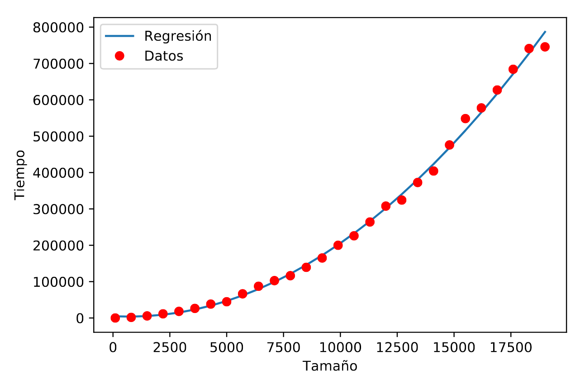

# Parte individual

> Autor: Andrés Millán Muñoz


## Tabla de contenidos


<!-- @import "[TOC]" {cmd="toc" depthFrom=1 depthTo=6 orderedList=false} -->

<!-- code_chunk_output -->

* [Parte individual](#parte-individual)
	* [Tabla de contenidos](#tabla-de-contenidos)
			* [Prestaciones del PC](#prestaciones-del-pc)
	* [Pivotar](#pivotar)
		* [Análisis teórico](#análisis-teórico)
	* [Búsqueda](#búsqueda)
		* [Análisis teórico](#análisis-teórico-1)
	* [Elimina repetidos](#elimina-repetidos)
		* [Análisis teórico](#análisis-teórico-2)
	* [Burbuja](#burbuja)
		* [Análisis teórico](#análisis-teórico-3)
		* [Análisis empírico](#análisis-empírico)
		* [Eficiencia híbrida](#eficiencia-híbrida)
	* [Hanoi](#hanoi)
		* [Análisis empírico](#análisis-empírico-1)

<!-- /code_chunk_output -->


#### Prestaciones del PC

Los programas han sido ejecutados en el siguiente ordenador:


## Pivotar

Código del programa:

```C++
int pivotar (int *v, const int ini, const int fin) {
    double pivote = v[ini], aux;
    int   i = ini + 1
        , j = fin;

    while (i <= j) {
        while (v[i] < pivote && i <= j)
            i++;

        while (v[j] >= pivote && j >= i)
            j--;

        if (i < j) {
            aux = v[i];
            v[i]  = v[j];
            v[j]  = aux;
        }
    }

    if (j > ini) {
        v[ini] = v[j];
        v[j]   = pivote;
    }

    return j;
}
```

### Análisis teórico

Observamos que la mayoría de operaciones son constantes. Tanto las asignaciones y las operaciones son `O(1)`, así que no influirán en nuestros cálculos. Como estamos hayando la notación O(), nos pondremos siempre en el peor de los casos.

Sea $a$ la constante que acota las operaciones más básicas del bucle padre, $b$ las operaciones realizadas por el segundo `while` y $c$ por las del tercero.

Debemos analizar los bucles del algoritmo. Vemos que `i = ini + 1` y `j = fin`. Asumamos que `ini` y `fin` adquirirán los máximos valores posibles; esto es, 0 y el tamaño del vector respectivamente.
Nuestro primer bucle se ejecuta mientras que `i <= j`. Ambos valores solo pueden cambiar si entran en alguno de los dos bucles centrales. Además, uno retrocede y otro avanza. Debido a que en ambos se haya la condición `i<=j`, la suma de las ejecuciones de ambas debe ser como máximo `O(n)`. Esto es,

$$\sum_{while\ 1}{b} + \sum_{while\ 2}{c} = fin - (inicio + 1) \sim n \Rightarrow O(n)$$

Volviendo al bucle inicial, tenemos que

$$\Big(\sum_{i \le j}{a}\Big) + n = fin - (inicio + 1) + n \sim 2n \Rightarrow O(2n) = O(n)$$

Concluimos entonces que la función es $O(n)$

## Búsqueda

Código del programa:

```c++
int Busqueda (int * v, int n, int elem) {
    int   inicio = 0
        , fin    = n - 1
        , centro = (inicio + fin)/2;

    while ((inicio <= fin) && (v[centro] != elem)) {
        if (elem < v[centro])
            fin = centro - 1;
        else
            inicio = centro + 1;

        centro = (inicio + fin)/2;
    }

    if (inicio > fin)
        return -1;

    return centro;
}
```

### Análisis teórico

Supongamos que `v` es un vector de `n` componentes. Las operaciones elementales son constantes, por lo que estarán acotadas por una constante. Sea $a$ dicha constante.
En este algoritmo, por cada iteración, consideraremos un subvector ordenado del original de tamaño la mitad que el anterior. En el peor de los casos, existen dos posibilidades:

- Se halla en el último subvector posible. Este tiene 1 sola componente
- No se encuentra el elemento.

```
             |_|_|_|_|_|_|_|_|_|_|_|
------|      ^         ^          ^
Iter 1|  inicio       centro       final
------|      ^    ^    ^
Iter 2|  inicio   c    fin
------|
```

Ambos casos pueden considerarse el mismo, pues solo los diferencia una iteración. Por tanto, tenemos que
$$T(n) = n \cdot \Big( \frac{1}{2}\Big)^{k}  = 1$$
donde $k$ es la iteración.
$$2^k \cdot n \cdot \Big( \frac{1}{2} \Big)^{k}  = 2^k \iff n = 2^k \iff log_2(n) = k$$

Se tiene entonces que la eficiencia del algoritmo es $O(log_2(n) + a) \sim O(log_2(n))$.

## Elimina repetidos

Código del programa:

```c++
void EliminaRepetidos (int original[], int & nOriginal) {
    int i, j, k;

    for (i = 0; i < nOriginal; i++) {
        j = i + 1;

        do {
            if (original[j] == original[i]) {
                for (k = j+1; k < nOriginal; k++)
                    original[k-1] = original[k];

                nOriginal--;
            }
            else
                j++;

        } while (j < nOriginal);
    }
}
```

### Análisis teórico

Las operaciones más básicas están acotadas por una constante, la cual no afectará al cálculo de la eficiencia.

El bucle for más profundo (`for (k = j+1; k < nOriginal; k++)`) tiene una eficiencia de $O(n)$. Combinado con el bucle `do {} while ()`, la cual también tiene una eficiencia de $O(n)$, hace que nuestro cuerpo central tenga una eficiencia de $O(n^2)$. Finalmente, esta parte central del código está envuelta en otro bucle for; el cual tiene también una eficiencia de $O(n)$. Concluimos que $EliminaRepetidos \in O(n^3)$

## Burbuja

Código del programa:

```c++
void burbuja (int T[], int inicial, int final) {
    int i, j, aux;

    for (i = inicial; i < final - 1; i++) {
        for (j = final - 1; j > i; j--) {
            if (T[j] < T[j-1]) {
                aux = T[j];
                T[j] = T[j-1];
                T[j-1] = aux;
            }
        }
    }
}
```
### Análisis teórico

Esta parte se omitirá, puesto que está resuelto en las diapositivas.

### Análisis empírico

Tras tomar mediciones para problemas del tamaño $N \in \{100, 800, 1500,...,19700\}$.

Haciendo la media tras 15 repeticiones para los respectivos tamaños, hemos hayado los siguientes resultados:

```
[3.26000000e+01 1.69213333e+03 5.68093333e+03 1.14388667e+04
 1.81502000e+04 2.63586667e+04 3.82041333e+04 4.46769333e+04
 6.64974667e+04 8.72912667e+04 1.02747867e+05 1.16345133e+05
 1.39302000e+05 1.64991267e+05 2.00004267e+05 2.25991933e+05
 2.64059933e+05 3.07806200e+05 3.24278800e+05 3.72669067e+05
 4.04209267e+05 4.75893467e+05 5.48431667e+05 5.77857867e+05
 6.27130733e+05 6.84090267e+05 7.41154000e+05 7.45778267e+05]
[  100   800  1500  2200  2900  3600  4300  5000  5700  6400  7100  7800
  8500  9200  9900 10600 11300 12000 12700 13400 14100 14800 15500 16200
 16900 17600 18300 19000]
```

Usando Jupyter con el núcleo python, planteamos los resultados y obtenemos el siguiente resultado:


Podemos observar que el crecimiento es muy rápido conforme aumenta el tamaño del problema, reflejando su ineficiencia a gran escala.

### Eficiencia híbrida

Teóricamente, sabemos que el algoritmo de burbuja es de tipo $O(n^2)$. Por tanto, ajustaremos los datos empíricos a una función de la forma $f(n) = a_2 \cdot x^2 + a_1 \cdot x + a_0$. Para ello, usaremos de nuevo Jupyter. Ponemos los comandos

```bash
coefs = np.polyfit(datos[:], medias[:], 2)
print(coefs)
```

lo cual arroja el resultado

```txt
[ 2.34036701e-03 -3.30863708e+00  4.85010651e+03]
```

Dibujamos el resultado junto a los puntos de antes y obtenemos



## Hanoi

Código del programa:

```c++
void hanoi (int M, int i, int j) {
    if (M > 0) {
        hanoi(M-1, i, 6-i-j);
        //cout << i << " -> " << j << endl;
        hanoi(M-1, 6-i-j, j);
    }
}
```

Hemos comentado la salida a pantalla puesto que es más cómodo a la hora de obtener los resultados. El main también ha sido modificado para mandarle el tamaño por parámetro:

```c++
int main(int argc, char const *argv[]) {
    if (argc != 2) {
        cout << "./hanoi tamaño";
        return -1;
    }

    int M = atoi(argv[1]);

    if (M <= 0) {
        cout << "El tamaño debe ser positivo";
        return -1;
    }

    auto t_antes = chrono::high_resolution_clock::now();
    hanoi(M, 1, 2);
    auto t_despues = chrono::high_resolution_clock::now();
    unsigned long t_ejecucion = chrono::duration_cast<chrono::microseconds>(t_despues - t_antes).count();

    cout << M << " " << t_ejecucion << endl;
    return 0;
}
```

### Análisis empírico

Esta vez, hemos usado los tamaños $N \in \{2, 3, 4, ..., 29\}$. Son tan bajos debido a que el crecimiento es enorme: la función es $O(2^n)$

De media, hemos obtenido estos valores tras 13 repeticiones:
```
[0.00000000e+00 6.66666667e-02 0.00000000e+00 0.00000000e+00
 9.33333333e-01 1.00000000e+00 2.13333333e+00 4.33333333e+00
 8.46666667e+00 1.66000000e+01 3.31333333e+01 6.61333333e+01
 1.32133333e+02 2.70800000e+02 5.44933333e+02 1.05693333e+03
 2.09346667e+03 4.16673333e+03 7.29393333e+03 1.47295333e+04
 2.69240667e+04 4.96691333e+04 9.37312667e+04 1.85862267e+05
 3.71657933e+05 7.40968333e+05 1.47997447e+06 2.95945560e+06]
[ 2  3  4  5  6  7  8  9 10 11 12 13 14 15 16 17 18 19 20 21 22 23 24 25
 26 27 28 29]
```

Se ha usado el siguiente script para ayudarnos:

```bash
#!/bin/bash

N=2

for j in {1..28}; do
	for i in {1..15}; do
		./hanoi $N >> resultados_hanoi.dat
	done

	N=$(($N+1))
done
```

Esta es la gráfica que generan dichos valores:


