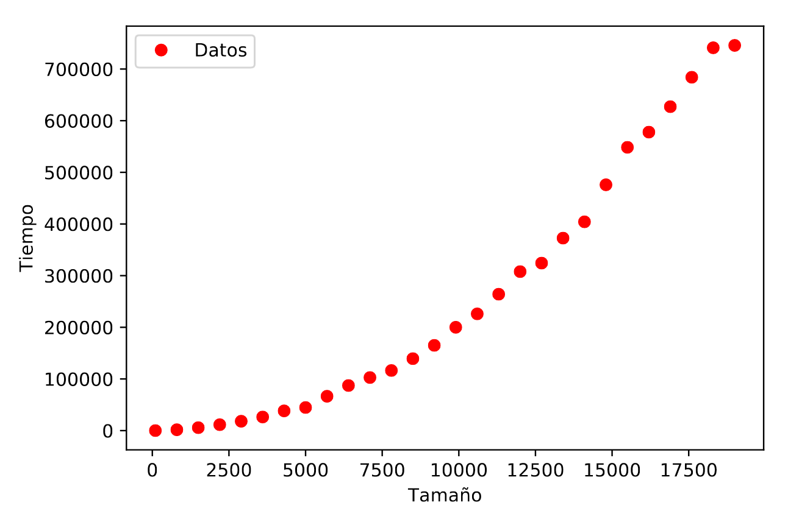

# Parte individual

> Autor: Andrés Millán Muñoz

#### Prestaciones del PC

Los programas han sido ejecutados en el siguiente ordenador:


## Pivotar

Código del programa:

```C++
int pivotar (int *v, const int ini, const int fin) {
    double pivote = v[ini], aux;
    int   i = ini + 1
        , j = fin;

    while (i <= j) {
        while (v[i] < pivote && i <= j)
            i++;

        while (v[j] >= pivote && j >= i)
            j--;

        if (i < j) {
            aux = v[i];
            v[i]  = v[j];
            v[j]  = aux;
        }
    }

    if (j > ini) {
        v[ini] = v[j];
        v[j]   = pivote;
    }

    return j;
}
```

### Análisis teórico

Observamos que la mayoría de operaciones son constantes. Tanto las asignaciones y las operaciones son `O(1)`, así que no influirán en nuestros cálculos. Como estamos hayando la notación O(), nos pondremos siempre en el peor de los casos.

Sea $a$ la constante que acota las operaciones más básicas del bucle padre, $b$ las operaciones realizadas por el segundo `while` y $c$ por las del tercero.

Debemos analizar los bucles del algoritmo. Vemos que `i = ini + 1` y `j = fin`. Asumamos que `ini` y `fin` adquirirán los máximos valores posibles; esto es, 0 y el tamaño del vector respectivamente.
Nuestro primer bucle se ejecuta mientras que `i <= j`. Ambos valores solo pueden cambiar si entran en alguno de los dos bucles centrales. Además, uno retrocede y otro avanza. Debido a que en ambos se haya la condición `i<=j`, la suma de las ejecuciones de ambas debe ser como máximo `O(n)`. Esto es,

$$\sum_{while\ 1}{b} + \sum_{while\ 2}{c} = fin - (inicio + 1) \sim n \Rightarrow O(n)$$

Volviendo al bucle inicial, tenemos que

$$\Big(\sum_{i \le j}{a}\Big) + n = fin - (inicio + 1) + n \sim 2n \Rightarrow O(2n) = O(n)$$

Concluimos entonces que la función es $O(n)$

## Búsqueda

Código del programa:

```c++
int Busqueda (int * v, int n, int elem) {
    int   inicio = 0
        , fin    = n - 1
        , centro = (inicio + fin)/2;

    while ((inicio <= fin) && (v[centro] != elem)) {
        if (elem < v[centro])
            fin = centro - 1;
        else
            inicio = centro + 1;

        centro = (inicio + fin)/2;
    }

    if (inicio > fin)
        return -1;

    return centro;
}
```

### Análisis teórico

Supongamos que `v` es un vector de `n` componentes. Las operaciones elementales son constantes, por lo que estarán acotadas por una constante. Sea $a$ dicha constante.
En este algoritmo, por cada iteración, consideraremos un subvector ordenado del original de tamaño la mitad que el anterior. En el peor de los casos, existen dos posibilidades:

- Se halla en el último subvector posible. Este tiene 1 sola componente
- No se encuentra el elemento.

```
             |_|_|_|_|_|_|_|_|_|_|_|
------|      ^         ^          ^
Iter 1|  inicio       centro       final
------|      ^    ^    ^
Iter 2|  inicio   c    fin
------|
```

Ambos casos pueden considerarse el mismo, pues solo los diferencia una iteración. Por tanto, tenemos que
$$T(n) = n \cdot \Big( \frac{1}{2}\Big)^{k}  = 1$$
donde $k$ es la iteración.
$$2^k \cdot n \cdot \Big( \frac{1}{2} \Big)^{k}  = 2^k \iff n = 2^k \iff log_2(n) = k$$

Se tiene entonces que la eficiencia del algoritmo es $O(log_2(n) + a) \sim O(log_2(n))$.

## Elimina repetidos

Código del programa:

```c++
void EliminaRepetidos (int original[], int & nOriginal) {
    int i, j, k;

    for (i = 0; i < nOriginal; i++) {
        j = i + 1;

        do {
            if (original[j] == original[i]) {
                for (k = j+1; k < nOriginal; k++)
                    original[k-1] = original[k];

                nOriginal--;
            }
            else
                j++;

        } while (j < nOriginal);
    }
}
```

### Análisis teórico

TOD

## Burbuja

Código del programa:

```c++
void burbuja (int T[], int inicial, int final) {
    int i, j, aux;

    for (i = inicial; i < final - 1; i++) {
        for (j = final - 1; j > i; j--) {
            if (T[j] < T[j-1]) {
                aux = T[j];
                T[j] = T[j-1];
                T[j-1] = aux;
            }
        }
    }
}
```
### Análisis teórico

Esta parte se omitirá, puesto que está resuelto en las diapositivas.

### Análisis empírico

Tras tomar mediciones para problemas del tamaño $N \in \{100, 1000, 10000, 100000, 500000, 1000000\}$.

Haciendo la media tras 13 repeticiones para los respectivos tamaños, hemos hayado los siguientes resultados:

```
100 22
1000 2031
10000 215831
100000 21578628
500000 707946706
1000000 2727125261
```

Usando gnuplot, planteamos los resultados y obtenemos el siguiente resultado:



Podemos observar que el crecimiento es muy rápido conforme aumenta el tamaño del problema, reflejando su ineficiencia a gran escala.

### Eficiencia híbrida

Teóricamente, sabemos que el algoritmo de burbuja es de tipo $O(n^2)$. Por tanto, ajustaremos los datos empíricos a una función de la forma $f(n) = a_2 \cdot x^2 + a_1 \cdot x + a_0$. Para ello, usaremos gnuplot de nuevo. Ponemos los comandos

```bash
f(x) = a2*x*x+a1*x+a0
fit f(x) 'salida_burbuja.dat' via a2,a1,a0
```

lo cual arroja el resultado

```txt
iter      chisq       delta/lim  lambda   a2            a1            a0
   0 1.0568015392e+24   0.00e+00  2.43e+11    1.000000e+00   1.000000e+00   1.000000e+00
   1 2.9274287509e+21  -3.60e+07  2.43e+10    5.521995e-02   9.999990e-01   1.000000e+00
   2 1.5687742596e+15  -1.87e+11  2.43e+09    2.761312e-03   9.999990e-01   1.000000e+00
   3 6.6625014627e+14  -1.35e+05  2.43e+08    2.732168e-03   9.999999e-01   1.000000e+00
   4 6.6624909340e+14  -1.58e-01  2.43e+07    2.732168e-03   1.000094e+00   1.000000e+00
iter      chisq       delta/lim  lambda   a2            a1            a0

After 4 iterations the fit converged.
final sum of squares of residuals : 6.66249e+14
rel. change during last iteration : -1.5803e-06

degrees of freedom    (FIT_NDF)                        : 3
rms of residuals      (FIT_STDFIT) = sqrt(WSSR/ndf)    : 1.49025e+07
variance of residuals (reduced chisquare) = WSSR/ndf   : 2.22083e+14

Final set of parameters            Asymptotic Standard Error
=======================            ==========================
a2              = 0.00273217       +/- 6.785e-05    (2.483%)
a1              = 1.00009          +/- 66.63        (6662%)
a0              = 1                +/- 8.119e+06    (8.119e+08%)

correlation matrix of the fit parameters:
                a2     a1     a0
a2              1.000
a1             -0.969  1.000
a0              0.381 -0.502  1.000
```

Dibujamos el resultado junto a los puntos de antes y obtenemos


## Hanoi

Código del programa:

```c++
void hanoi (int M, int i, int j) {
    if (M > 0) {
        hanoi(M-1, i, 6-i-j);
        //cout << i << " -> " << j << endl;
        hanoi(M-1, 6-i-j, j);
    }
}
```

Hemos comentado la salida a pantalla puesto que es más cómodo a la hora de obtener los resultados. El main también ha sido modificado para mandarle el tamaño por parámetro:

```c++
int main(int argc, char const *argv[]) {
    if (argc != 2) {
        cout << "./hanoi tamaño";
        return -1;
    }

    int M = atoi(argv[1]);

    if (M <= 0) {
        cout << "El tamaño debe ser positivo";
        return -1;
    }

    auto t_antes = chrono::high_resolution_clock::now();
    hanoi(M, 1, 2);
    auto t_despues = chrono::high_resolution_clock::now();
    unsigned long t_ejecucion = chrono::duration_cast<chrono::microseconds>(t_despues - t_antes).count();

    cout << M << " " << t_ejecucion << endl;
    return 0;
}
```

### Análisis empírico

Esta vez, hemos usado los tamaños $N \in \{2, 9, 16, 23, 30\}$. Son tan bajos debido a que el crecimiento es enorme: la función es $O(2^n)$

De media, hemos obtenido estos valores tras 13 repeticiones:
```
2 0
9 13
16 513
23 47642
30 5951871
```

Se ha usado el siguiente script para ayudarnos:

```bash
#!/bin/bash

for j in {1..13}; do
    N=2

    for i in {1..5}; do
        ./hanoi $N >> resultados_hanoi.txt
        N=$(($N+7))
    done
done
```

Usamos de nuevo gnuplot y obtenemos lo siguiente:


