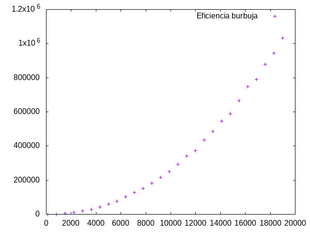
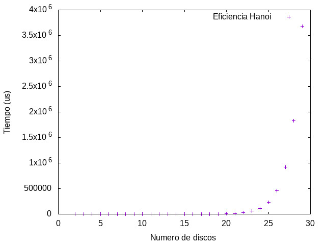
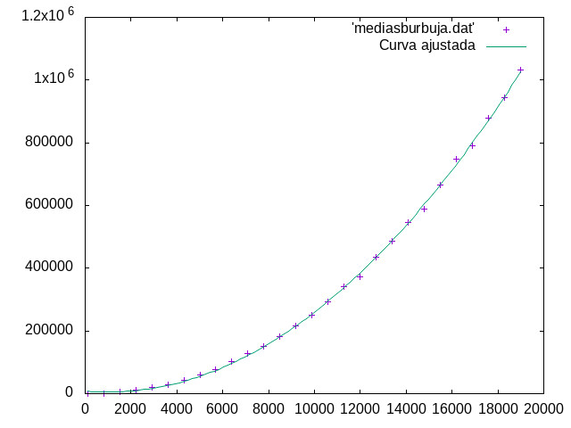

# Parte individual

## Juan Antonio Villegas Recio

### Análisis teórico:

#### Algoritmo pivotaje:

```c++
int pivotar (int *v, const int ini, const int fin) {
        double pivote = v[ini], aux;
        int   i = ini + 1
            , j = fin;

        while (i <= j) {
            while (v[i] < pivote && i <= j)
                i++;

            while (v[j] >= pivote && j >= i)
                j--;

            if (i < j) {
                aux = v[i];
                v[i]  = v[j];
                v[j]  = aux;
            }
        }

        if (j > ini) {
            v[ini] = v[j];
            v[j]   = pivote;
        }

        return j;
}
    
```
Si miramos el código de abajo arriba, la sentencia `return` y las sentencias `if` son todas de orden `O(1)`, luego su ejecución se puede considerar con una constante $a$.

Ahora veamos los bucles. Encontramos un bucle que anida a otros dos menores. Los bucles menores tienen un incremento y decremento respectivamente de una variable, y esa operación es `O(1)`, luego también se puede acotar mediante constantes $b_1$ y $b_2$. Además de estos dos bucles, el primero de todos incluye una sentencia `if` que también es constante, por lo que podemos acotarla mediante una constante $c$.

Ahora analicemos las iteraciones, con respecto a las iteraciones de los dos bucles internos, vemos que `i = ini + 1` y `j = fin`. Asumimos que `ini` y `fin`, en el peor de los casos, representarán el inicio y el final del vector; esto es, 0 y el tamaño del vector (n).
Los bucles se ejecutan mientras que `i <= j`. i sólo cambia su valor si entra al primer bucle y j si entra al segundo. En total, como ambos comparten la condición `i<=j`, en total entre los dos bucles hacen como máximo n-1 iteraciones (porque el valor inicial de i es `ini+1`). Por tanto el cuerpo del bucle padre tarda en ejecutarse un tiempo lineal. Es decir,

$\sum_{while\ 1}{b_1} + \sum_{while\ 2}{b_2} +c= fin - (inicio + 1) +c\sim n$

Concluimos por tanto que el algoritmo es de orden $O(n)$.

#### Algoritmo de búsqueda binaria iterativo:

```c++
int Busqueda (int * v, int n, int elem) {
        int   inicio = 0
            , fin    = n - 1
            , centro = (inicio + fin)/2;

        while ((inicio <= fin) && (v[centro] != elem)) {
            if (elem < v[centro])
                fin = centro - 1;
            else
                inicio = centro + 1;

            centro = (inicio + fin)/2;
        }

        if (inicio > fin)
            return -1;

        return centro;
    }
```

Tanto la declaración de las variables, como la sentencia `if`, como la sentencia `return` son `O(1)` y por tanto constantes. La clave está en hallar la eficiencia del bucle `while` interno.

El cuerpo del bucle while se compone de una sentencia `O(1)` y de una sentencia condicional. Como sentencia condicional que es, su eficiencia es el máximo del cuerpo del `if` y el cuerpo del `else`, pero como ambas son constantes, concluimos que el cuerpo completo del bucle es `O(1)` y se puede acotar por una constante $a$.

Veamos cuantas veces se itera este bucle. En el peor de los casos, no se encuentra el elemento que se busca o se llega a un vector de una sola componente. Ambos casos se diferencian en un tiempo constante, así que los trataremos como iguales, en particular nos centraremos en el segundo caso. Se itera hasta que `inicio>=fin` y en cada iteración se considera un vector de tamaño la mitad que el anterior, luego, en la última iteración, $k$:

$$n \cdot \Big( \frac{1}{2}\Big)^{k}  = 1$$

Multiplicando por $2^k$ y aplicando el cambio de variable $n=2^k$ tenemos:

$$2^k \cdot n \cdot \Big( \frac{1}{2} \Big)^{k}  = 2^k \iff n = 2^k \iff log_2(n) = k$$

Por tanto este algoritmo es de orden $O(\log_2(n))$.


#### Algoritmo EliminaRepetidos:

```c++
    void EliminaRepetidos (int original[], int & nOriginal) {
        int i, j, k;

        for (i = 0; i < nOriginal; i++) {
            j = i + 1;

            do {
                if (original[j] == original[i]) {
                    for (k = j+1; k < nOriginal; k++)
                        original[k-1] = original[k];

                    nOriginal--;
                }
                else
                    j++;

            } while (j < nOriginal);
        }
    }
```

El código se compone de tres bucles anidados, el bucle más interno, dentro de una sentencia `if`, se compone de una simple asignación, que podemos acotar por una constante $a$, El bucle se ejecuta desde `k=j+1` y hasta `nOriginal`, por tanto se ejecuta $n-j-1\sim n-j$ veces. El bucle do-while se compone de una sentencia if-else, por tanto se considera la el tiempo mayor de los dos bloques. El bloque else es $O(1)$, luego claramente la eficiencia mayor es la del bloque if, que es la del bucle mencionado anteriormente.

Este bucle se ejecuta desde `j=i+1` y hasta `nOriginal`, por tanto se ejecuta $n-i-1\sim n-i$ veces.

Por último el bucle se ejecuta desde `i=0` y hasta `nOriginal`, por tanto, se ejecuta $n$ veces.

Veamos el número de iteraciones. Los casos extremos son: un vector en el que todos los elementos estén repetidos y un vector en el que ningún elemento esté repetido.

En el primer caso, se repite el bucle for más interno $n-1\sim n$ veces, y el bucle do-while también $n$ veces. En total, como están anidados, se multiplica y el algoritmo es por tanto de orden $O(n^2)$ . En el segundo caso, el bucle interno nunca llega a ejecutarse, y son simplemente dos bucles anidados que contienen un bloque de código $O(1)$ y cada uno de ellos se ejecuta $n$ veces, luego el algoritmo es por tanto en este caso también $O(n^2)$.

Concluimos entonces que el algoritmo es de orden $O(n^2)$.

### Análisis empírico

#### Algoritmo de ordenación por burbuja

De forma teórica, sabemos que el algoritmo burbuja es de orden $O(n^2)$. Para probarlo empíricamente, se ha ejecutado y medido el tiempo de ejecución del algoritmo con hasta 25 tamaños diferentes desde 100 hasta 19000 incrementando en 700 componentes en cada ejecución. Para tener una medida más segura, la ejecución con cada tamaño se ha repetido 15 veces y el dato que se concluye para ese tamaño es la media de todos los obtenidos. En el fichero `tiempos.ods` se pueden ver todos y cada uno de esos tiempos y la media de todos ellos.

Con las medias obtenidas, podemos esbozar una nube de puntos en la que comprobar la tendencia a aumentar el tamaño cuadráticamente.




### Algoritmo de las torres de Hanoi

El problema de las torres de Hanoi cuenta con un algoritmo recursivo para resolverlo. Teóricamente es de orden exponencial $O(2^n)$. En este caso hemos seguido el mismo procedimiento que en el algoritmo burbuja, pero los tamaños deben ser mucho más pequeños. Los tamaños han sido desde 2 hasta 29, incrementando de uno en uno. El resultado obtenido es el siguiente:



Comprobamos que tiende a crecer de forma exponencial.

### Análisis híbrido

#### Algoritmo de ordenación por burbuja

A la nube de puntos obtenida en el algoritmo burbuja se le ha ajustado una parábola, para obtener así la ecuación que nos calcularía el tiempo a estimar para cierto tamaño de un vector.

La ecuación obtenida es la siguiente:

$$y=0.00315643x^2-6.44384x+8554.02$$



Con estos datos se ha obtenido un coeficiente de correlación de $r=0.9587$, que es un número muy cercano a 1, luego podemos estimar que la bondad del ajuste es alta.