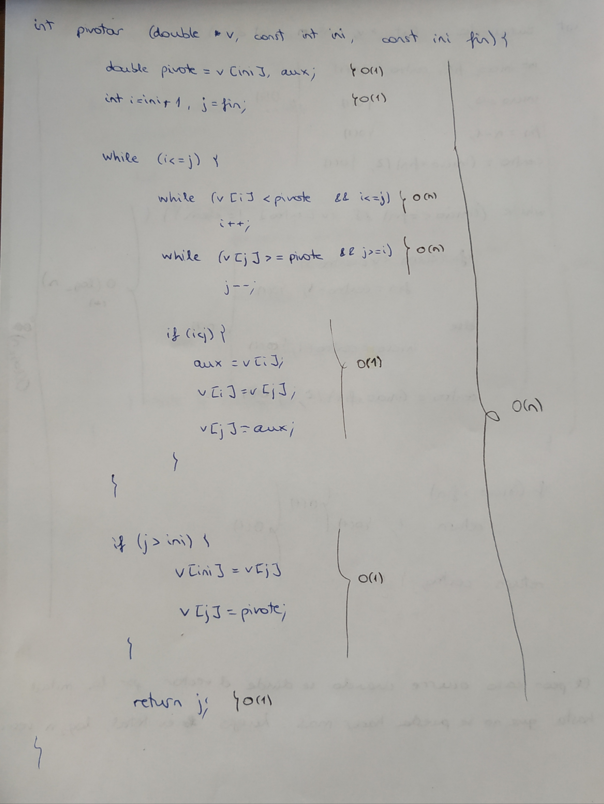
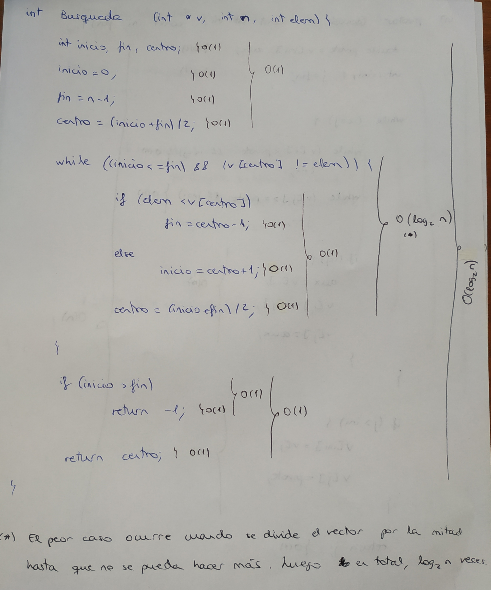
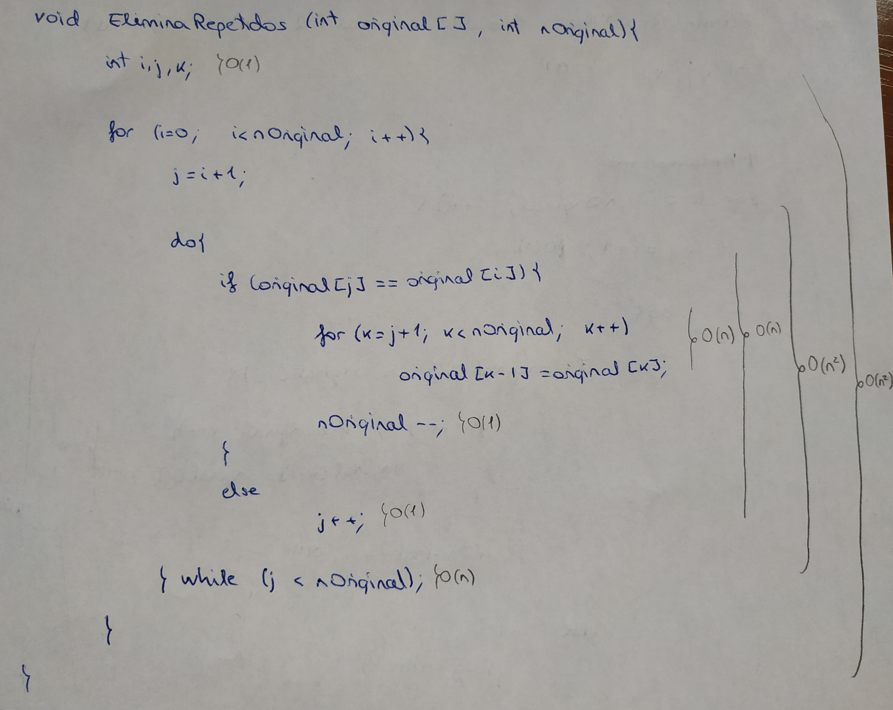
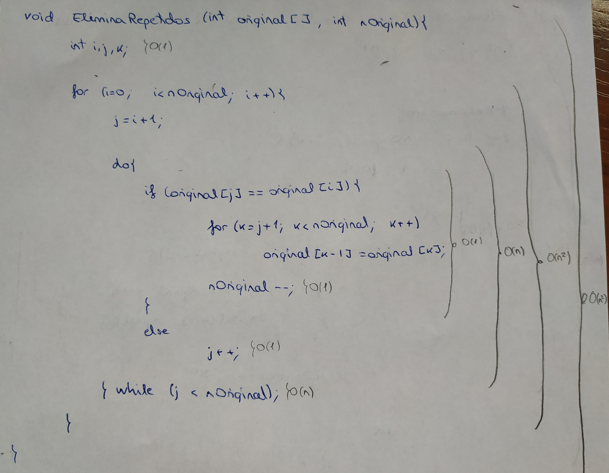
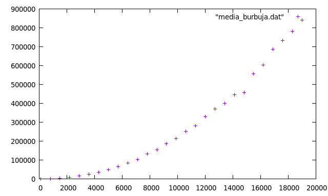
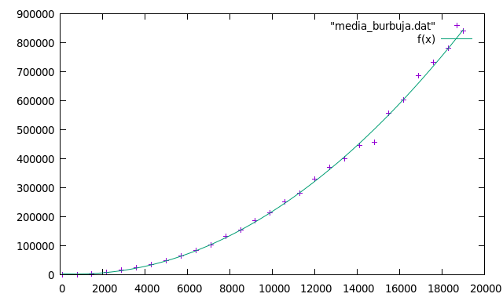
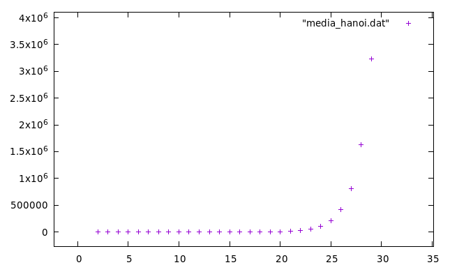

# Práctica 1. Eficencia

> Autora: Paula Villanueva Núñez

> Doble grado ingeniería informática y matemáticas

Información sobre mi PC:

- Procesador: Intel Core i7-5600U CPU 2.60GHz x 4
- OS: Ubuntu 18.04.2 LTS
- Compilador: g++ 4:7.3.0-3ubuntu1~18.04 amd64 GNU C++ compiler
- Kernel: 4.15.0-46-generic #49-Ubuntu SMP

## Algoritmo 1: pivotar

```c++
int pivotar (int *v, const int ini, const int fin){
    double pivote = v[ini], aux;
    int i = ini + 1, j = fin;

    while (i <= j) {
        while (v[i] < pivote && i <= j)
            i++;

        while (v[j] >= pivote && j >= i)
            j--;

        if (i < j) {
            aux = v[i];
            v[i]  = v[j];
            v[j]  = aux;
        }
    }

    if (j > ini) {
        v[ini] = v[j];
        v[j]   = pivote;
    }

    return j;
}
```

### Análisis teórico

En este algoritmo, la mayoría de las operaciones son $O(1)$, solo tenemos que estudiar los bucles `while`. Los bucles `while` que comparan el elemento con el pivote, hacen en total `n` iteraciones y como aumentan y disminuyen la `i` y la `j`, respectivamente, el primer bucle `while` no tiene que hacer más iteraciones, luego la eficiencia total es $O(n)$.

<p>

</p>


## Algoritmo 2: Búsqueda

```c++
int Busqueda (int * v, int n, int elem) {
    int inicio = 0, fin = n - 1, centro = (inicio + fin)/2;

    while ((inicio <= fin) && (v[centro] != elem)) {
        if (elem < v[centro])
            fin = centro - 1;
        else
            inicio = centro + 1;

        centro = (inicio + fin)/2;
    }

    if (inicio > fin)
        return -1;

    return centro;
}
```

### Análisis teórico

En este algoritmo tenemos un vector `v` con `n` componentes y un elemento `elem` que se quiere encontrar. Tenemos que todas las operaciones son $O(1)$, es decir, son constantes, excepto el bucle `while`. En este algoritmo, tenemos que el peor caso es que no se encuentre el elemento `elem` o que se encuentre en la última iteración. Vamos a considerar ambos casos el mismo, ya que a la hora de calcular la eficiencia solo se diferencian en una iteración, lo cual no influye. En ambos casos nos quedaría un vector con 1 componente.

<p>

</p>

$\pagebreak$

## Algoritmo 3: Elimina repetidos

```c++
void EliminaRepetidos (int original[], int & nOriginal) {
    int i, j, k;

    for (i = 0; i < nOriginal; i++) {                 // Bucle i
        j = i + 1;

        do {                                          // Bucle j
            if (original[j] == original[i]) {
                for (k = j+1; k < nOriginal; k++)     // Bucle k
                    original[k-1] = original[k];

                nOriginal--;
            }
            else
                j++;

        } while (j < nOriginal);
    }
}
```

### Análisis teórico

En este algoritmo, tenemos que el peor caso pueda ser que el vector tenga todos los elementos repetidos o que ninguno esté repetido.

- Si el vector tiene todos los elementos repetidos, entonces tenemos el siguiente análisis teórico:

    <p>
    
    </p>

    donde el bucle `k` haría `n` iteraciones y el bucle `j` haría `n` iteraciones también, luego en total tendríamos n^2 iteraciones. Como la variable `nOriginal` disminuye en una unidad n veces, tenemos que cuando se sale del bucle `j`, el bucle `i` no haría más iteraciones. Luego la eficiencia total de este algoritmo es $O(n^2)$.

- Si el vector no tiene ningún elemento repetido, entonces tenemos el siguiente análisis teórico:

    <p>
    
    </p>

    donde el bucle `j` haría `n` iteraciones, ya que no entra al bucle `k` y aumenta en una unidad la variable `j` n veces. Además, como la variable `nOriginal` no varía en este caso, tenemos que el bucle `i` realiza otras `n` iteraciones, luego la eficiencia total de este algoritmo es $O(n^2)$.


## Algoritmo burbuja

Teóricamente, se ha obtenido que este algoritmo es de orden $O(n^2)$.

### Eficiencia empírica

Para calcular la eficiencia empírica, he calculado el tiempo de ejecución del programa `burbuja.cpp` con distintos tamaños de entrada. He calculado 15 tiempos para cada entrada y he hecho su correspondiente media. En la siguiente tabla se recoge la información obtenida.

| Tamaño | Tiempo |
| ---------- | ---------- |
|100|34.4666666666667|
|800|1193.46666666667|
|1500|4178.93333333333|
|2200|8984		|
|2900|15610.5333333333	|
|3600|24181.1333333333	|
|4300|34982.8		|
|5000|49021.4666666667|		
|5700|64747.9333333333|
|6400|84615.1333333333|		
|7100|104305.266666667|		
|7800|131525.266666667|		
|8500|154291.533333333|		
|9200|187051.8		|
|9900|213417.6		|
|10600|251316.533333333|		
|11300|280959.133333333	|
|12000|329192.8|
|12700|371335		|
|13400|399470.733333333	|
|14100|446832.6		|
|14800|457446		|
|15500|556346.8	|
|16200|603275.733333333|		
|16900|687471.4		|
|17600|731310|
|18300|780320.2|		
|19000|840700.866666667|

Usando `gnuplot`, he representado estos datos y he obtenido la siguiente gráfica.

<p>

</p>

### Eficiencia híbrida

He calculado la recta de regresión que mejor se ajusta a los datos obtenidos basándome en el cálculo de la eficiencia teórica, y he obtenido la siguiente gráfica.

<p>

</p>

donde la función $f(x)$ que mejor se ajusta es

$$ f(x) = 0.00253781 x^2 -3.99236 x + 4607.59 $$.

Para ello, `gnuplot` ha proporcionado la siguiente información:

```

*******************************************************************************
Sat Mar  9 15:52:30 2019


FIT:    data read from "media_burbuja.dat"
        format = z
        #datapoints = 28
        residuals are weighted equally (unit weight)

function used for fitting: f(x)
	f(x)=a*x**2+b*x+c
fitted parameters initialized with current variable values

iter      chisq       delta/lim  lambda   a             b             c            
   0 7.7075963057e+17   0.00e+00  9.60e+07    1.000000e+00   1.000000e+00   1.000000e+00
  11 3.0306188076e+09  -7.18e-04  9.60e-04    2.537813e-03  -3.992360e+00   4.607594e+03

After 11 iterations the fit converged.
final sum of squares of residuals : 3.03062e+09
rel. change during last iteration : -7.17696e-09

degrees of freedom    (FIT_NDF)                        : 25
rms of residuals      (FIT_STDFIT) = sqrt(WSSR/ndf)    : 11010.2
variance of residuals (reduced chisquare) = WSSR/ndf   : 1.21225e+08

Final set of parameters            Asymptotic Standard Error
=======================            ==========================
a               = 0.00253781       +/- 7.29e-05     (2.873%)
b               = -3.99236         +/- 1.44         (36.07%)
c               = 4607.59          +/- 5943         (129%)

correlation matrix of the fit parameters:
                a      b      c      
a               1.000
b              -0.967  1.000
c               0.727 -0.853  1.000
```

## Algoritmo hanoi

Teóricamente, se ha obtenido que este algoritmo es de orden $O(2^n)$.

### Eficiencia empírica

Para calcular la eficiencia empírica, he calculado el tiempo de ejecución del programa `hanoi.cpp` con distintos tamaños de entrada. He calculado 25 tiempos para cada entrada y he hecho su correspondiente media. En la siguiente tabla se recoge la información obtenida.

| Tamaño | Tiempo |
| ---------- | ---------- |
|2|0|
|3|0|
|4|0|
|5|0|
|6|0|
|7|1|
|8|2|
|9|3.08|
|10|6.36|
|11|12.96|
|12|26.96|
|13|55.88|
|14|102.52|
|15|205.6|
|16|502.96|
|17|896.2|
|18|1683.8|
|19|3430.68|
|20|7031.08|
|21|13284.68|
|22|26517.32|
|23|52092.68|
|24|102868.92|
|25|204968.96|
|26|412233.36|
|27|813599.28|
|28|1624506.24|
|29|3238043.88|

Usando `gnuplot`, he representado estos datos y he obtenido la siguiente gráfica.

<p>

</p>
