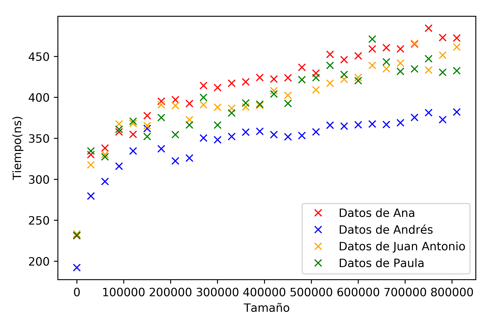
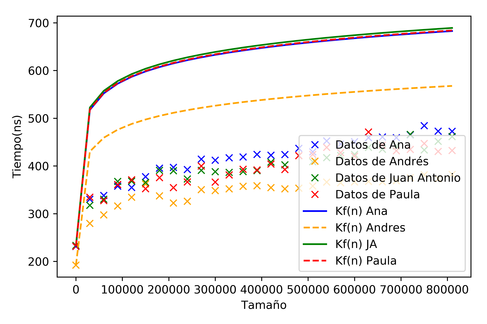
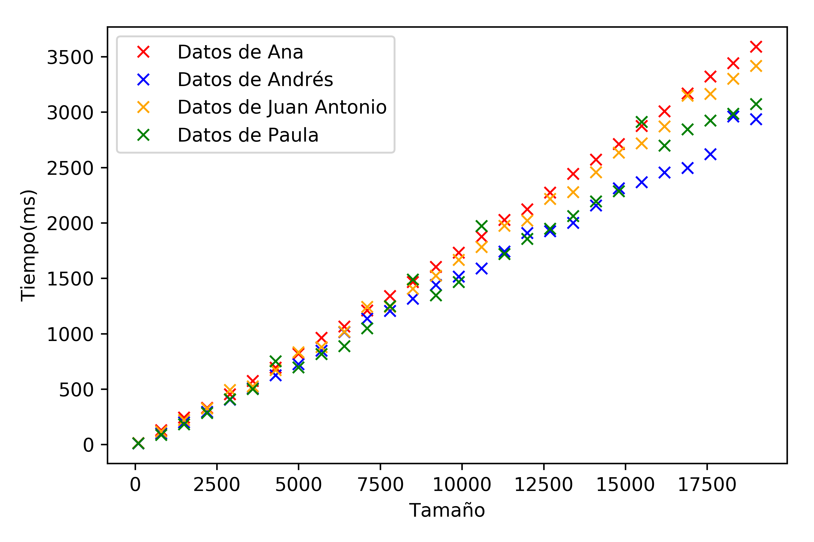
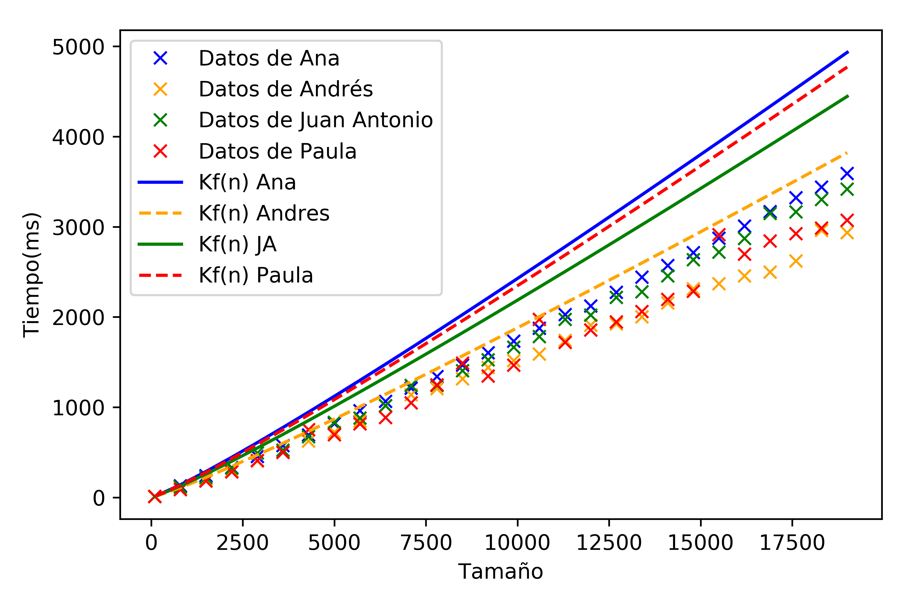
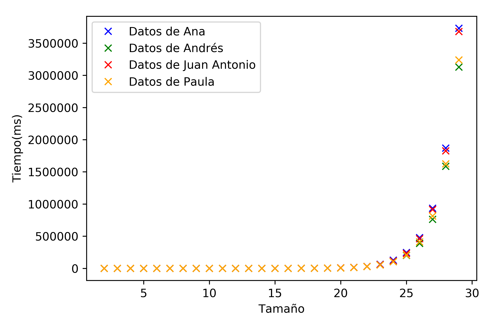
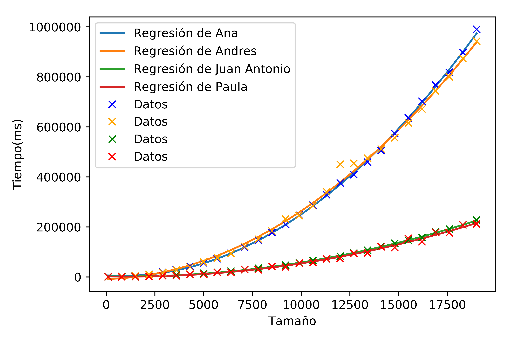
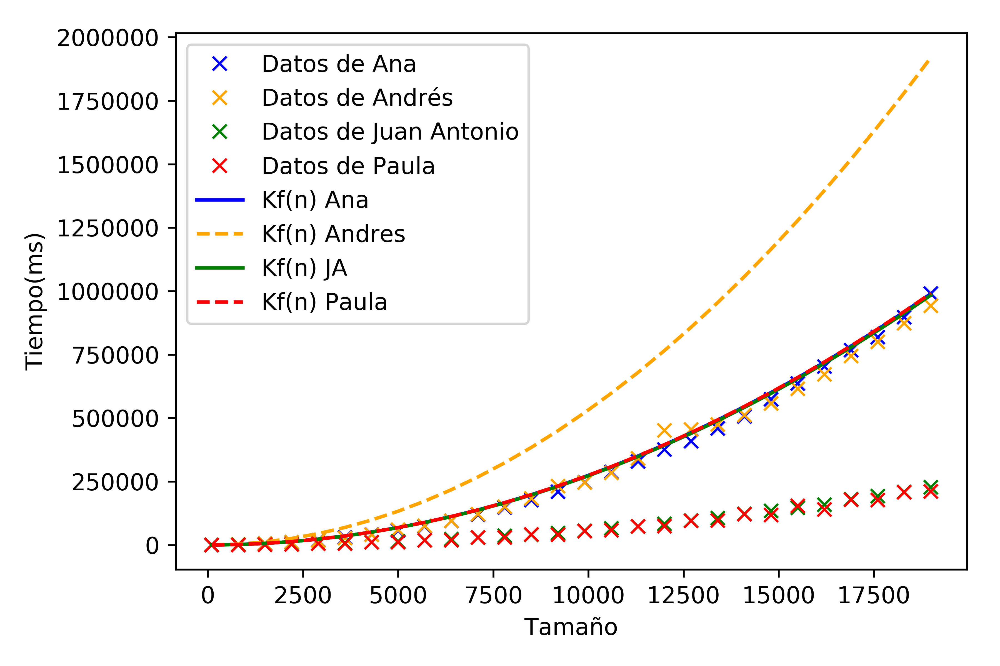
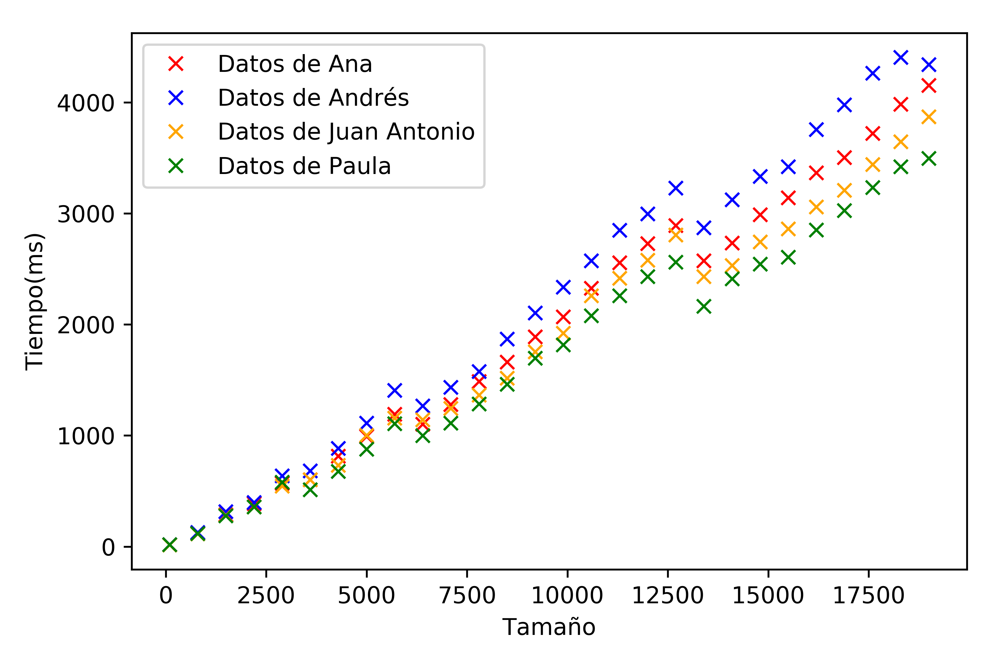
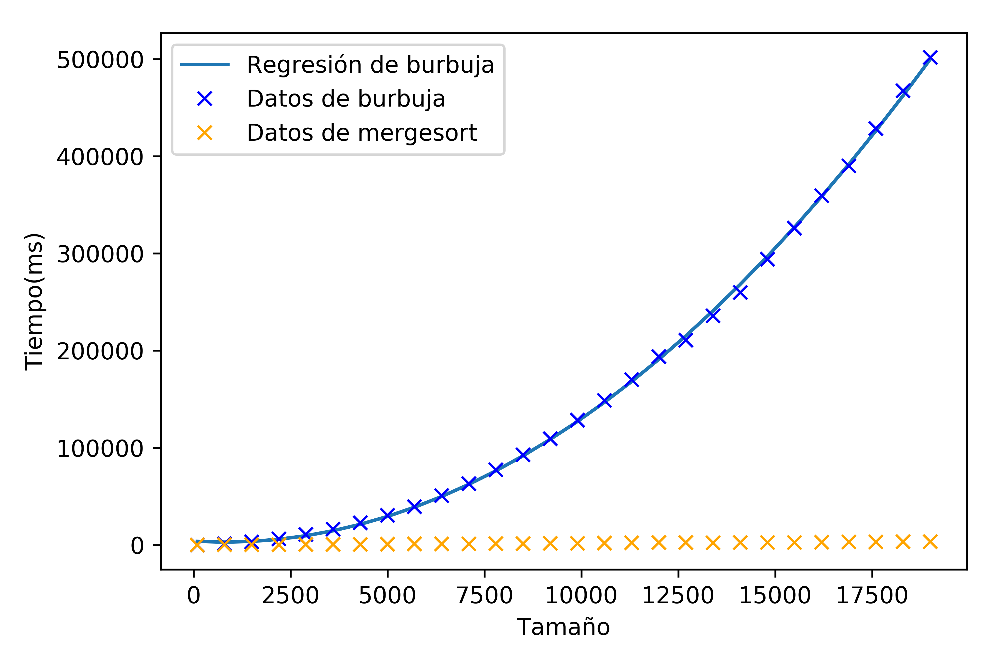

# Presentación grupal

Autores:

> Ana Buendía, Andrés Millán, Paula Villanueva, Juan Antonio Villegas

---

## Objetivos

- Solución teórica de los algoritmos 4 y 5.
- Comparación eficiencia empírica e híbrida de los algoritmos 4 y 5.
- Puesta en común de diferentes algoritmos.

---

## Especificaciones

| Persona      | CPU               | OS                    |
|--------------|-------------------|-----------------------|
| Ana          | i5-6200U 2.30GHz  | Ubuntu 16.04 LTS      |
| Andrés       | i5-8250U 3.40GHz  | Antergos 4-19.29 LTS  |
| Paula        | i7-5600U 2.60GHz  | Ubuntu 18.04 LTS      |
| Juan Antonio | i7-4500U 3.00GHz  | Ubuntu 18.04 LTS      |

---

## Algoritmo 4

#### BuscarBinario

##### Eficiencia teórica

```txt
             |_|_|_|_|_|_|_|_|_|_|_|
------|      ^         ^          ^
Iter 1|  inicio       centro       final
------|      ^    ^    ^
Iter 2|  inicio   c    fin
------|
```

Decrece en $n/2$
<p class="fragment fade-up">
    $T(n) = T(n/2)+a$
</p>
---

Cambio de variable $n = 2^k$

$$T(2^k) = a + T(2^{k-1})$$
$$T(2^{k-1}) = a + T(2^{k-2})$$
...
$$T(2^k) = a \cdot k + 1$$

Deshaciendo el cambio de variable, obtenemos

$$T(n) = a \cdot log_2(n) + 1$$

---

**BuscarBinario** es $O(log_2(n))$

---

##### Eficiencia empírica



---

#### Eficiencia híbrida



---

### Constante K

| Persona      | *K*             |
| ------------ | :------------ |
| Ana          | 34.785220119  |
| Andrés       | 28.9263485708 |
| Juan Antonio | 35.1166541442 |
| Paula        | 34.8506188855 |

---

## Algoritmo 5

#### Heapsort

---

#### Eficiencia teórica

- `reajustar`:
    - Bucle `while`: se ejecuta como máximo $log_2(\frac{n}{2}) = log_2n -1$ veces.
    - Resto de operaciones: constante $a$.
    - Eficiencia: $alog_2n-a$.

---

#### Eficiencia teórica

- `heapsort`:
    - Primer bucle: llama a `reajustar` $\frac{n}{2}$ veces. Eficiencia:
      $$ \left( \frac{n}{2}+1 \right) (alog_2n-a)$$
    - Segundo bucle: operaciones elementales ($b$) y llama a `reajustar`. Se ejecuta $n-1$ veces. Eficiencia:
      $$ a(n-1)(log_2n-1)+b(n-1)$$
- Eficiencia del algoritmo: $O(nlog_2n)$.

---

##### Eficiencia empírica



---


##### Eficiencia híbrida



---

### Constante K

| Persona      | *K*               |
| ------------ | :-------------- |
| Ana          | 0.0182624864036 |
| Andrés       | 0.0141484097962 |
| Juan Antonio | 0.0164563064296 |
| Paula        | 0.0176604264123 |

---

## Hanoi

---

##### Eficiencia teórica

$O(2^n)$

---

##### Eficiencia empírica



---

## Burbuja

---


##### Eficiencia empírica



---


#### Eficiencia híbrida




---

### Constante K

| Persona      | *K*                |
| ------------ | :--------------- |
| Ana          | 0.00274223536473 |
| Andrés       | 0.00533          |
| Juan Antonio | 0.00272666666667 |
| Paula        | 0.00274666666667 |

---

## Mergesort

---

##### Eficiencia teórica

$O(nlog_2(n))$

---

##### Eficiencia empírica



---

##### Eficiencia híbrida


---

### Constante K

| Persona      | *K*               |
| ------------ | :-------------- |
| Ana          | 0.0257882362952 |
| Andrés       | 0.0229786230024 |
| Juan Antonio | 0.0213731296921 |
| Paula        | 0.0252865196358 |

---

## Comparativa burbuja y mergesort

<p class="fragment fade-up">
    $$Burbuja \in O(n^2)$$

    $$Mergesort \in O(n + nlog_2(n)) \sim O(nlog_2(n))$$
</p>

---

###### Comparativa empírica burbuja y mergesort



---

<p class="fragment fade-up">
    Coinciden los modelos teóricos y empíricos
</p>
