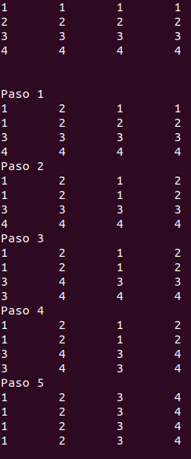

# Práctica 2. Divide y vencerás
Grupo: Las algas

> Ana Buendía, Andrés Millán, Paula Villanueva, Juan Antonio Villegas

---

## Objetivos
- Traspuesta de una matriz $2^k$ elementos.
- Traspuesta de una matriz $N^M$ elementos.
- Calcular mínimo y máximo de un vector.

---

## Especificaciones

| Persona      | CPU               | OS                    |
|--------------|-------------------|-----------------------|
| Ana          | i5-6200U 2.30GHz  | Ubuntu 16.04 LTS      |
| Andrés       | i5-8250U 3.40GHz  | Antergos 4-19.29 LTS  |
| Paula        | i7-5600U 2.60GHz  | Ubuntu 18.04 LTS      |
| Juan Antonio | i7-4500U 3.00GHz  | Ubuntu 18.04 LTS      |

---

## Traspuesta de matriz cuadrada con 2^k elementos

---

###### Traspuesta de matriz cuadrada con 2^k elementos

### Eficiencia teórica (no DyV)

- $n$: número de elementos.
- Recorre una vez la matriz: $T(n) = a \cdot n.$

$$O(n)$$

---

###### Traspuesta de matriz cuadrada con 2^k elementos

### Eficiencia teórica (DyV)

- `intercambiar`: $O(n)$.
- `trasponerDyV`:
    - $a$: dos primeras líneas.
    - $b$: tiempo ejecución `intercambiar`.
    $$T(n) = a + T \left( \frac{n}{4} \right) + nb$$

---

`$$n = 2^k \Rightarrow t_k = T(2^k) = 4t_{k-2}+2^kb+a$$`
`$$t_{k+2}-4t_k = 2^kb + a$$`

$$ $$

$$t_k^h = c_12^k + c_2(-2)^k$$
$$t_k^p = c_3k2^k+c_4$$
$$t_k = c_12^k + c_2(-2)^k + c_3k2^k + c_4$$
$$O(nlog_2n)$$

---

###### Traspuesta de matriz cuadrada con 2^k elementos

### Eficiencia empírica (no DyV)

>Insertar gráfica eficiencia empírica no DyV

---

###### Traspuesta de matriz cuadrada con 2^k elementos

### Eficiencia empírica (DyV)

$f(x) = 8.61866395x - 9.50365406 · 10^4$

---

###### Traspuesta de matriz cuadrada con 2^k elementos

### Eficiencia híbrida (no DyV)

>Insertar ef hibrida

K =

---

###### Traspuesta de matriz cuadrada con 2^k elementos

### Eficiencia híbrida (DyV)

K = 3'143991

---

###### Traspuesta de matriz cuadrada con 2^k elementos

### Comparación DyV y no DyV

>Insertar gráfica de ambas (DyV y no DyV) y ver dónde se cortan

---

## Traspuesta de una matriz 2^2 (DyV)

---

## Traspuesta de una matriz 2^2 (DyV)

---

## Traspuesta de una matriz N^M

---

###### Traspuesta de una matriz N^M

### Eficiencia teórica (no DyV)

>Insertar eficiencia teórica no DyV

---

###### Traspuesta de una matriz N^M

### Eficiencia teórica (DyV)

>Insertar eficiencia teórica no DyV

---

###### Traspuesta de una matriz N^M

### Eficiencia empírica (no DyV)

>Insertar gráfica eficiencia empírica no DyV

---

###### Traspuesta de una matriz N^M

### Eficiencia empírica (DyV)

>Insertar gráfica eficiencia empírica DyV

---

###### Traspuesta de una matriz N^M

### Eficiencia híbrida (no DyV)

>Insertar gráfica eficiencia híbrida no DyV

K =

---

###### Traspuesta de una matriz N^M

### Eficiencia híbrida (DyV)

>Insertar gráfica eficiencia híbrida DyV

K =

---

###### Traspuesta de una matriz N^M

### Comparación DyV y no DyV

>Insertar gráfica de ambas (DyV y no DyV) y ver dónde se cortan

---

## Máximo y mínimo de un vector

---

###### Máximo y mínimo de un vector

### Eficiencia teórica (no DyV)

>Insertar eficiencia teórica no DyV

---

###### Máximo y mínimo de un vector

### Eficiencia teórica (DyV)

- `maximo`:
  $$T(n) = a \; \; si \; n \leq 2$$
  $$T(n) = T\left( \frac{n}{2} \right) + b \; \; si \; n>2$$

---

  `$$n=2^k \Rightarrow T(2^k) = t_k = 2t_{k-1} + b$$`

  $$t_k^h = c_1 2^k$$
  $$t_k^p = -\frac{-b}{2} = c_2$$

  $$t_k = c_1 2^k + c_2 \Rightarrow T(n) = c_1n + c_2 \Rightarrow O(n)$$

---

###### Máximo y mínimo de un vector

### Eficiencia empírica (no DyV)

>Insertar gráfica eficiencia empírica no DyV

---

###### Máximo y mínimo de un vector

### Eficiencia empírica (DyV)

---

###### Máximo y mínimo de un vector

### Eficiencia híbrida (no DyV)

>Insertar gráfica eficiencia híbrida no DyV

K =

---

###### Máximo y mínimo de un vector

### Eficiencia híbrida (DyV)

---

### Constante K (DyV)

K = 0'00617544

---

###### Máximo y mínimo de un vector

### Comparación DyV y no DyV

>Insertar gráfica de ambas (DyV y no DyV) y ver dónde se cortan
