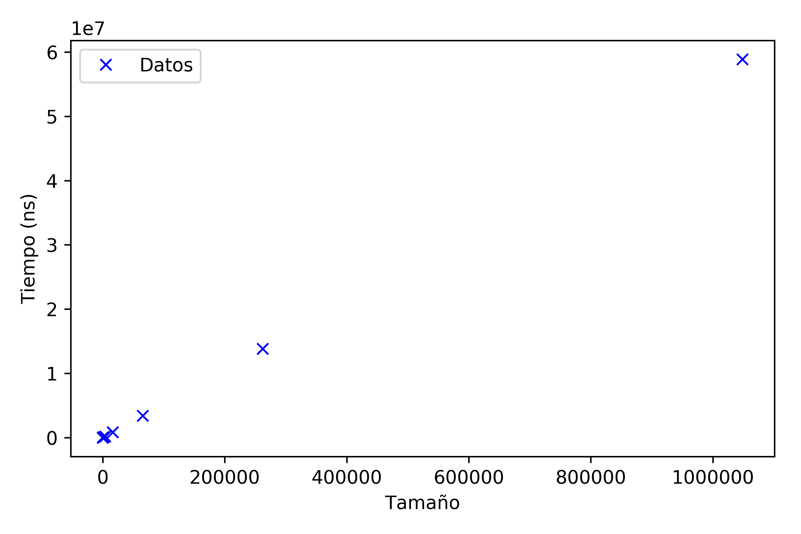

# Práctica 2. Divide y vencerás
Grupo: Las Algas

> Ana Buendía, Andrés Millán, Paula Villanueva, Juan Antonio Villegas

---

## Objetivos
- Traspuesta de una matriz $2^k$ elementos.
- Traspuesta de una matriz $N^M$ elementos.
- Calcular mínimo y máximo de un vector.

---

## Especificaciones

| Persona      | CPU               | OS                    |
|--------------|-------------------|-----------------------|
| Ana          | i5-6200U 2.30GHz  | Ubuntu 16.04 LTS      |
| Andrés       | i5-8250U 3.40GHz  | Antergos 4-19.29 LTS  |
| Paula        | i7-5600U 2.60GHz  | Ubuntu 18.04 LTS      |
| Juan Antonio | i7-4500U 3.00GHz  | Ubuntu 18.04 LTS      |

---

## Traspuesta de matriz cuadrada con 2^k elementos

---

###### Traspuesta de matriz cuadrada con 2^k elementos

### Eficiencia teórica (no DyV)

```c++
void trasposicion_usual (vector<vector<int>> matriz,
                         vector<vector<int>> & destino) {
    for (int i = 0; i < matriz[0].size(); ++i)
        for (int j = 0; j < matriz.size(); ++j)
            destino[j][i] = matriz[i][j];
}
```

- $n$: número de elementos.
- Recorre una vez la matriz: $T(n) = a \cdot n.$

$$O(n)$$

---

###### Traspuesta de matriz cuadrada con 2^k elementos

### Eficiencia teórica (DyV)

```c++
void intercambiar(vector<vector<int>> & matriz, int fIniA,
                  int cIniA, int fIniB, int cIniB, int dim) {
  for (size_t i = 0; i < dim ; i++) {
      for (size_t j = 0; j < dim; j++) {
         int aux = matriz[fIniA + i][cIniA+j];
         matriz[fIniA+i][cIniA+j] = matriz[fIniB+i][cIniB+j];
         matriz[fIniB+i][cIniB+j] = aux;
      }
  }
}
```

- `intercambiar`: $O(n)$.

---

###### Traspuesta de matriz cuadrada con 2^k elementos

### Eficiencia teórica (DyV)

```c++
void trasponerDyV (vector<vector<int>> & matriz, int fInicio,
                   int fFin, int cInicio, int cFin) {
    if (fInicio < fFin) {
        int fMedio = (fInicio + fFin)/2;
        int cMedio = (cInicio + cFin)/2;

        trasponerDyV(matriz,fInicio,fMedio,cInicio,cMedio);
        trasponerDyV(matriz,fInicio,fMedio,cMedio+1,cFin);
        trasponerDyV(matriz,fMedio+1,fFin,cInicio,cMedio);
        trasponerDyV(matriz,fMedio+1,fFin, cMedio+1,cFin);
        intercambiar(matriz,fMedio+1,cInicio,fInicio,
                     cMedio+1,fFin-fMedio);
    }
}
```

---

###### Traspuesta de matriz cuadrada con 2^k elementos

### Eficiencia teórica (DyV)

- `trasponerDyV`:
    - $a$: dos primeras líneas.
    - $b$: tiempo ejecución `intercambiar`.
    $$T(n) = a + T \left( \frac{n}{4} \right) + nb$$

---

`$$n = 2^k \Rightarrow t_k = T(2^k) = 4t_{k-2}+2^kb+a$$`
`$$t_{k+2}-4t_k = 2^kb + a$$`

$$ $$

$$t_k^h = c_12^k + c_2(-2)^k$$
$$t_k^p = c_3k2^k+c_4$$
$$t_k = c_12^k + c_2(-2)^k + c_3k2^k + c_4$$
$$O(nlog_2n)$$

---

###### Traspuesta de matriz cuadrada con 2^k elementos

### Eficiencia empírica (no DyV)


---

###### Traspuesta de matriz cuadrada con 2^k elementos

### Eficiencia empírica (DyV)



---

###### Traspuesta de matriz cuadrada con 2^k elementos

### Eficiencia híbrida (no DyV)


$$K = 1.4927433516698971$$

---

###### Traspuesta de matriz cuadrada con 2^k elementos

### Eficiencia híbrida (DyV)


$$K = 3.205694396131746$$

---

###### Traspuesta de matriz cuadrada con 2^k elementos

### Comparación DyV y no DyV


---

## Traspuesta de una matriz 4x4 (DyV)

---

## Traspuesta de una matriz 4x4 (DyV)


---

## Máximo y mínimo de un vector

---

###### Máximo y mínimo de un vector

### Eficiencia teórica (no DyV)

```c++
int maximo (const vector<int> & flechita) {
    int max = flechita[0];

    for (auto elemento: flechita)
        if (elemento > max)
            max = elemento;

    return max;
}
```

$$O(n)$$

---

###### Máximo y mínimo de un vector

### Eficiencia teórica (no DyV)

```c++
int minimo (const vector<int> & flechita) {
    int min = flechita[0];

    for (auto elemento: flechita)
        if (elemento < min)
            min = elemento;

    return min;
}
```

$$O(n)$$

---

###### Máximo y mínimo de un vector

### Eficiencia teórica (DyV)

```c++
int maximo (vector<int> &flechita, int l, int r) {
   if (l<=r) {
       if (r - l <= 1)
          if (flechita[l] < flechita[r]) return flechita[r];
          else return flechita[l];
       else {
          int m    = (l + r)/2;
          int maxL = maximo(flechita, l, m);
          int maxR = maximo(flechita, m + 1, r);
          if (maxL < maxR) return maxR;
          else return maxL;
       }
   }
}
```

---

###### Máximo y mínimo de un vector

### Eficiencia teórica (DyV)

- `maximo`:
  $$T(n) = a \; \; si \; n \leq 2$$
  $$T(n) = T\left( \frac{n}{2} \right) + b \; \; si \; n>2$$

---

  `$$n=2^k \Rightarrow T(2^k) = t_k = 2t_{k-1} + b$$`

  $$t_k^h = c_1 2^k$$
  $$t_k^p = -\frac{-b}{2} = c_2$$

  $$t_k = c_1 2^k + c_2 \Rightarrow T(n) = c_1n + c_2 \Rightarrow O(n)$$

---

###### Máximo y mínimo de un vector

### Eficiencia empírica (no DyV)


---

###### Máximo y mínimo de un vector

### Eficiencia empírica (DyV)


---


###### Máximo y mínimo de un vector

### Eficiencia híbrida (no DyV)


$$K = 11.0769$$

---

###### Máximo y mínimo de un vector

### Eficiencia híbrida (DyV)


$$K = 17.4801$$

---


###### Máximo y mínimo de un vector

### Comparación DyV y no DyV


$$No \; DyV: f(x) = 8.371884234608126x + 10051.1421$$

$$DyV: g(x) = 12.6470098x + 15089.5402$$

---

## Conclusiones
- El enfoque DyV en estos casos no es más eficiente.
- La recursividad consume tiempo de ejecución que afecta a la eficiencia.
- Los algoritmos DyV son sencillos de entender.
