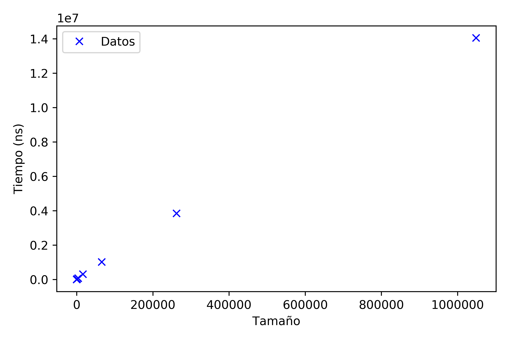
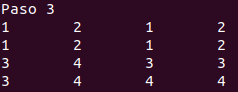
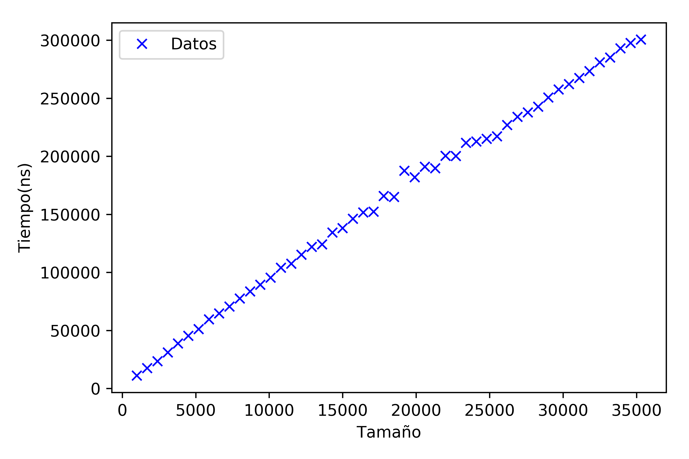

# Memoria Práctica 2: Divide y Vencerás
Grupo: Las Algas

> Ana Buendía, Andrés Millán, Paula Villanueva, Juan Antonio Villegas


## Especificaciones

| Persona      | CPU              | OS                   |
| ------------ | ---------------- | -------------------- |
| Ana          | i5-6200U 2.30GHz | Ubuntu 16.04 LTS     |
| Andrés       | i5-8250U 3.40GHz | Antergos 4-19.29 LTS |
| Paula        | i7-5600U 2.60GHz | Ubuntu 18.04 LTS     |
| Juan Antonio | i7-4500U 3.00GHz | Ubuntu 18.04 LTS     |

---
## Objetivos

- Resolver dos problemas con la metodología Divide y Vencerás
- Exponer los tres tipos de eficiencia
- Mostrar cómo proceden los algoritmos
- Comparar el efoque Divide y Vencerás con el enfoque fuerza bruta
- Comprender las diferencias entre ambos

---

## Problema común: Traspuesta de una matriz

### Versión fuerza bruta

#### Código

```c++
void trasposicion_usual (vector<vector<int>> matriz, vector<vector<int>> & destino) {
    for (int i = 0; i < matriz[0].size(); ++i)
        for (int j = 0; j < matriz.size(); ++j)
            destino[j][i] = matriz[i][j];
}
```

#### Análisis teórico

Llamamos $n$ al número de elementos de la matriz, como el algoritmo intercambia los elementos de la matriz original con los de la matriz destino, simplemente se recorre una vez la matriz. Si llamamos $a$ al tiempo que tarda en hacer la asignación, entonces $T(n)=a\cdot n$, por lo que el algoritmo es $O(n)$.

#### Análisis empírico

Ejecutamos el código usual varias veces con distintos tamaños. Para este problema, hemos ejecutado el programa para matrices cuadradas de $2^k \times 2^k$ (posteriormente se ejecutará la versión DyV con los mismos tamaños). Con los tiempos de cada ejecución hemos calculado el tiempo medio de respuesta y obtenemos los siguientes resultados:

| Tamaño  | Tiempo (ns) |
| ------- | ----------- |
| 4       | 1372.66667  |
| 16      | 1985.33333  |
| 64      | 3659.33333  |
| 256     | 9164.66667  |
| 1024    | 22883.3333  |
| 4096    | 69242.6667  |
| 16384   | 304148.000  |
| 65536   | 1015661.00  |
| 262144  | 3839003.00  |
| 1048576 | 14048979.0  |

Y plasmando los tiempos medios de cada tamaño en una gráfica obtenemos la siguiente nube de puntos:



En la eficiencia teórica obtuvimos que el algoritmo era de orden lineal, y podemos observar en este caso que la tendencia de los puntos es crecer linealmente con el incremento del tamaño del problema.

#### Análisis híbrido

Calculamos la constante $K=1.49274$ asociada a los resultados teóricos y empíricos y obtenemos una cota superior del tiempo de ejecución esperado, es decir, mediante la función $T(n)=K\cdot n$ podemos estimar el tiempo máximo que cabe esperar de la ejecución para un cierto tamaño $n$.


### Versión divide y vencerás

Dada una matriz  $A\in \mathcal{M}_{N\times M}(\mathbb{Z})$, con $N$ y $M$ números naturales potencia de 2, se trata de trasponer la matriz usando la técnica de divide y vencerás.

Para ello subdividimos la matriz en 4 partes y aprovechamos que, si

$$A=\Big(\begin{matrix}A_{11} & \vert & A_{12} \\ \hline A_{21} & \vert & A_{22}  \end{matrix}\Big)$$
Entonces $$A^t=\Big(\begin{matrix}A_{11}^t & \vert & A_{21}^t \\ \hline A_{12}^t & \vert & A_{22}^t  \end{matrix}\Big)$$

El problema $P$ es trasponer la matriz $A$. Y este se puede dividir en 4 subproblemas $P_i$, $i=1,2,3,4$, que se corresponden con el cálculo de las traspuestas de las 4 submatrices antes descritas, siendo estas las soluciones $S_i$, $i=1,2,3,4$ de los problemas $P_i$. Posteriormente, estas soluciones se pueden combinar mediante un intercambio de posiciones obteniendo así a través de $S_i$ la solución $S$ del problema $P$.


#### Código

```c++
void intercambiar(vector<vector<int>> & matriz, int fIniA, int cIniA, int fIniB, int cIniB, int dim) {
    for (size_t i = 0; i < dim ; i++) {
        for (size_t j = 0; j < dim; j++) {
            int aux = matriz[fIniA + i][cIniA + j];
            matriz[fIniA + i][cIniA + j] = matriz[fIniB + i][cIniB + j];
            matriz[fIniB + i][cIniB + j] = aux;
        }
    }
}

void trasponerDyV (vector<vector<int>> & matriz, int fInicio, int fFin, int cInicio, int cFin) {
    if (fInicio < fFin) {
        int fMedio = (fInicio + fFin)/2;
        int cMedio = (cInicio + cFin)/2;

        trasponerDyV(matriz, fInicio,    fMedio, cInicio,    cMedio);
        trasponerDyV(matriz, fInicio,    fMedio, cMedio + 1, cFin);
        trasponerDyV(matriz, fMedio + 1, fFin,   cInicio,    cMedio);
        trasponerDyV(matriz, fMedio + 1, fFin,   cMedio + 1, cFin);

        intercambiar(matriz, fMedio + 1, cInicio, fInicio, cMedio + 1, fFin - fMedio);
    }
}

void trasponer (vector<vector<int>> & matriz) {
    trasponerDyV (matriz, 0, matriz[0].size()-1, 0, matriz.size()-1);
}
```

Si tomamos un tamaño de 4x4, podemos ver claramente los pasos que se realizan en el algoritmo:


1. En el primer paso se ha traspuesto la submatriz $A_{11}$.

   

2. En el segundo la submatriz $A_{12}$.

   


3. En el tercero $A_{21}$.

   


4. Y por último en el cuarto paso se traspone $A_{22}$.

   

5. Una vez está traspuesta cada submatriz por su lado se llama a la función intercambiar y se intercambia la posición de $A_{12}^t$ y de $A_{21}^t$. Cabe destacar que en cada trasposición a su vez se llama recursivamente a la función y se aplica el mismo método.

   

#### Análisis teórico

Estudiar la eficiencia teórica de la función `trasponer` es equivalente a estudiar la eficiencia teórica de la función `trasponerDyV`. Suponiendo $n$ el número de datos de la matriz, primero debemos calcular la eficiencia teórica de la función `intercambiar`. Esta función únicamente intercambia los valores de dos de las submatrices, por lo que sólo necesita recorrer la cuarta parte de la matriz original. Es decir, $T(n)=a\frac{n}{4}$, siendo $a$ el tiempo que tarda en ejecutarse el bloque de código del bucle más interno. Por tanto, la función `intercambiar` es de orden $O(n)$.

Sabiendo esto, ahora planteamos el tiempo de ejecución de la función `trasponerDyV` como una recurrencia, llamamos $a$ al tiempo de ejecución de las 2 primeras líneas y $b$ a la constante asociada a la ejecución de `intercambiar`. Así, tenemos $T(n)=a+4T(\frac{n}{4})+nb$. Hacemos el cambio de variable $n=2^k$ y llamamos $t_k=T(2^k)$ por lo que se tiene la ecuación $t_k=4t_{k-2}+2^kb+a$, equivalentemente $t_{k+2}-4t_{k}=2^{k}b+a$. Procedemos a resolverla:

Primero resolvemos la ecuación homogénea asociada $t_k=4t_{k-2}$. Su polinomio característico es $p(\lambda)=\lambda^2-4=(\lambda-2)(\lambda+2)$, por tanto la solución es $t_k^h=c_1 2^k +c_2 (-2)^k$.

Para hallar una solución particular, como el término independiente de la ecuación es una constante y una expresión $2^kb$, siendo 2 raíz del polinomio, existe una solución particular $t_k^p=c_3k2^k+c_4$. Por tanto, la solución de la ecuación es $t_k=c_1 2^k +c_2 (-2)^k+c_3k2^k+c_4$, y deshaciendo el cambio de variable, vemos 	que la función es $O(n\log_2 n)$.

#### Análisis empírico

Ejecutamos el nuevo programa para los mismos tamaños que el caso anterior, de nuevo calculamos los tiempos medios y los resultados han sido los siguientes:


|Tamaño   |Tiempo (ns)     |
|---------|----------------|
| 4       | 490.000000 |
| 16      | 792.000000 |
| 64      | 2622.66667 |
| 256     | 11384.3333 |
| 1024    | 37762.0000 |
| 4096    | 177945.000 |
| 16384   | 821086.333 |
| 65536   | 3368519.00 |
| 262144  | 13790910.3 |
| 1048576 | 58877627.3 |

Y si lo representamos gráficamente, obtenemos la siguiente gráfica:


#### Análisis híbrido

FIXME

La constante $K$ para DyV es $K = 3.14399$


### Comparación entre ambas versiones

Aparentemente, ya las eficiencias teóricas nos dicen que el enfoque DyV no es muy útil en este caso (al menos la implementación propuesta), ya que la versión por fuerza bruta es de eficiencia lineal $O(n)$ y la versión DyV es de eficiencia $O(n\cdot\log_2 n)$, es decir, es más ineficiente.

En el siguiente gráfico observamos el comportamiento de la versión fuerza bruta con respecto a la versión DyV:


Observando las tablas de las eficiencias empíricas, para tamaños relativamente pequeños, hasta 256 componentes, la versión DyV tarda en media menos que la versión fuerza bruta, sin embargo, a partir de esos valores (umbral), la versión DyV tarda hasta 4 veces más en nuestra muestra, tal y como nos afirmaba la eficiencia calculada teóricamente.

---


## Problema asignado: Máximo y mínimo de un vector

### Versión fuerza bruta

#### Código

```c++
int maximo (const vector<int> & flechita) {
    int max = flechita[0];

    for (auto elemento: flechita)
        if (elemento > max)
            max = elemento;

    return max;
}
```

```c++
int minimo (const vector<int> & flechita) {
    int min = flechita[0];

    for (auto elemento: flechita)
        if (elemento < min)
            min = elemento;

    return min;
}
```

#### Análisis teórico

Si llamamos $a$ al tiempo de ejecución de la declaración de variables y retorno, teniendo en cuenta que el bucle en el peor de los casos recorre todo el vector comprobando si el elemento actual es mayor (resp. menor) que el guardado en la variable, llamamos $b$ al cuerpo del bucle. Concluimos entonces que $T(n)=a+bn$, siendo $n$ el número de elementos del vector. Por tanto el algoritmo es de orden $O(n)$.

#### Análisis empírico

Hemos ejecutado el programa para distintos tamaños cada vez mayores. En este caso, el tamaño de los vectores podía ser cualquiera, por lo que tenemos una muestra más representativa. De nuevo, presentamos los tiempos medios de ejecución para diferentes tamaños:

|Tamaño |Tiempo(ns) |
|-------|-----------|
| 1000  | 11076.9   |
| 1700  | 17406.26  |
| 2400  | 23426.59  |
| 3100  | 31001.05  |
| 3800  | 38677.94  |
| 4500  | 45342.96  |
| 5200  | 51058.87  |
| 5900  | 59485.72  |
| 6600  | 64576.2   |
| 7300  | 70536.66  |
| 8000  | 77474.99  |
| 8700  | 83593.76  |
| 9400  | 89221.96  |
| 10100 | 95340.16  |
| 10800 | 103956.4  |
| 11500 | 107475.53 |
| 12200 | 115099.34 |
| 12900 | 121971.32 |
| 13600 | 124138.54 |
| 14300 | 134267.3  |
| 15000 | 138060.31 |
| 15700 | 146197.98 |
| 16400 | 151597.84 |
| 17100 | 152290.61 |
| 17800 | 165665.5  |
| 18500 | 164865.84 |
| 19200 | 187533.82 |
| 19900 | 181914.34 |
| 20600 | 190996.07 |
| 21300 | 189679.07 |
| 22000 | 200292.65 |
| 22700 | 200212.71 |
| 23400 | 211529.02 |
| 24100 | 212739.45 |
| 24800 | 215036.65 |
| 25500 | 217209.97 |
| 26200 | 226801.95 |
| 26900 | 233866.44 |
| 27600 | 237713.11 |
| 28300 | 242681.09 |
| 29000 | 250556.97 |
| 29700 | 257580.54 |
| 30400 | 262190.64 |
| 31100 | 267327.37 |
| 31800 | 273388.29 |
| 32500 | 280961.35 |
| 33200 | 284962.92 |
| 33900 | 292940.2  |
| 34600 | 297618.28 |
| 35300 | 300502.62 |

Y si representamos estos tiempos en una gráfica, obtenemos lo siguiente:



Las ejecuciones nos dan de nuevo la razón, los tiempos tienden a crecer de forma lineal.

#### Análisis híbrido

Calculamos la constante $K=11.0769$ y obtenemos mediante la función $T(n)=K\cdot n$ una cota superior del tiempo de ejecución estimado para un vector de tamaño $n$.


Además, si aplicamos un ajuste por regresión lineal por mínimos cuadrados, obtenemos una función de aproximación de $T(n)=8.3718x + 10051.1421$.

### Versión Divide y Vencerás

Para resolver este problema, procederemos de la manera que sigue: Dividiremos el vector en dos partes y obtendremos el máximo (resp. mínimo) de cada subvector para después compararlos y devolver el máximo (resp. mínimo). Si el tamaño de los vectores está por encima del umbral, volveremos a aplicar el procedimiento.

El problema $P$ es encontrar el máximo o mínimo del vector, y se puede subdividir en 2 subproblemas $P_1,P_2$  de la misma naturaleza, de tamaño menor (la mitad), y por tanto más fácil de resolver que $P$. Las soluciones $S_1,S_2$ de estos subproblemas se pueden integrar fácilmente simplemente comparándolas y devolviendo la mayor o menor dependiendo del caso, obteniendo a partir de $S_1$ y $S_2$ la solución $S$ del problema $P$.


#### Código

```c++
int maximo (vector<int> &flechita, int l, int r) {
    if (l<=r) {
        if (r - l <= 1) {
            if (flechita[l] < flechita[r])
                return flechita[r];
            else
                return flechita[l];
        }
        else {
            int m    = (l + r)/2;
            int maxL = maximo(flechita, l, m);
            int maxR = maximo(flechita, m + 1, r);

            if (maxL < maxR)
                return maxR;
            else
                return maxL;
        }
    }
}
```

```c++
int minimo (vector<int> &flechita, int l, int r) {
    if (l<=r) {
        if (r - l <= 1) {
            if (flechita[l] > flechita[r])
                return flechita[r];
            else
                return flechita[l];
        }

        else {
            int m    = (l + r)/2;
            int minL = minimo(flechita, l, m);
            int minR = minimo(flechita, m + 1, r);

            if (minL < minR)
                return minL;
            else
                return minR;
        }
    }
}
```

#### Análisis teórico

Analizamos la eficiencia teórica de la función `maximo`, ya que la otra es análoga. La función es recursiva, luego necesitamos una ecuación de recurrencia para plantearlo. Si el tamaño del vector a buscar es 2 o menos, tenemos un bloque `if-else` cada uno con una sentencia de tiempo constante, luego este caso se puede acotar con una constante $a$. El caso en el que el tamaño sea mayor que 2, hay dos llamadas a la propia función pero el tamaño es de la mitad junto con un conjunto de sentencias que se pueden acotar por una constante $b$. Resumiendo:

$$T(n)=a \text{ si } n \leq 2$$
$$T(n)=T\Big(\frac{n}{2}\Big)+b \text{ si } n>2$$

Resolvamos la recurrencia. Para ello, hacemos el cambio de variable $n=2^k$, y denotamos $T(2^k)=t_k$. Entonces, la segunda ecuación quedaría como: $t_k=2t_{k-1}+b$. Resolvemos esta ecuación de recurrencia.

Primero calculamos la solución de la homogénea asociada: $t_{k+1}-2t_k=0$

La ecuación característica es $\lambda -2=0$, por lo que su única solución es $\lambda = 2$, por tanto la solución a la ecuación homogénea es: $t_k^h=c_1\cdot 2^k$ siendo $c_1$ una constante que depende del valor inicial.

Calculamos ahora una solución particular, que sería una solución constante, que denotamos por $t_k^p$. Se tiene que $t_k^p- 2t_k^p-b=0$, despejamos y nos queda $t_k^p=-\frac{b}{2}=c_2$, que denotaremos como $c_2$ porque es otra constante.

En conclusión: $t_k=t_k^h +t_k^p=c_1\cdot 2^k+c_2$, y deshaciendo el cambio de variable, obtenemos $T(n)=c_1\cdot n+c_2$. Observando la ecuación, concluimos que el algoritmo es de orden $O(n)$.


#### Análisis empírico

De nuevo ejecutamos el programa para los mismos datos que en el caso de fuerza bruta y hacemos la media, obteniendo la siguiente tabla de tiempos.

|Tamaño |Tiempo (ns) |
|-------|-----------|
| 1000  | 17124.41  |
| 1700  | 29248.43  |
| 2400  | 41952.34  |
| 3100  | 53449.67  |
| 3800  | 58703.59  |
| 4500  | 63887.05  |
| 5200  | 78738.89  |
| 5900  | 102182.14 |
| 6600  | 108114.56 |
| 7300  | 114577.42 |
| 8000  | 124062.86 |
| 8700  | 118395.54 |
| 9400  | 130194.81 |
| 10100 | 142474.06 |
| 10800 | 151641.5  |
| 11500 | 163974.56 |
| 12200 | 176395.61 |
| 12900 | 179478.75 |
| 13600 | 182739.59 |
| 14300 | 193834.29 |
| 15000 | 195088.25 |
| 15700 | 203249.08 |
| 16400 | 211291.24 |
| 17100 | 225605.21 |
| 17800 | 239432.45 |
| 18500 | 243737.73 |
| 19200 | 262712.63 |
| 19900 | 270800.09 |
| 20600 | 276985.77 |
| 21300 | 293789.68 |
| 22000 | 302751.95 |
| 22700 | 324750.38 |
| 23400 | 332130.61 |
| 24100 | 338556.47 |
| 24800 | 339450.7  |
| 25500 | 346985.78 |
| 26200 | 351615.95 |
| 26900 | 355759.7  |
| 27600 | 363887.49 |
| 28300 | 368805.91 |
| 29000 | 377582.62 |
| 29700 | 382984.75 |
| 30400 | 390604.6  |
| 31100 | 397581.34 |
| 31800 | 406711.62 |
| 32500 | 413452.25 |
| 33200 | 427352.46 |
| 33900 | 437596.57 |
| 34600 | 449180.3  |
| 35300 | 470034.78 |

Si ahora representamos en un gráfico estos tiempos, obtenemos lo siguiente:


De nuevo observamos un incremento lineal del tiempo de ejecución, tal y como nos decía el cálculo teórico.

#### Análisis híbrido

Calculamos la constante $K = 17.4801$ y obtenemos mediante la función $T(n)=K\cdot n$ una cota superior del tiempo de ejecución estimado del algoritmo para un vector de $n$ componentes.


Además, si aplicamos un ajuste por regresión lineal por mínimos cuadrados, obtenemos una función de aproximación de $12.6470098x + 15089.5402$.

### Comparación entre ambas versiones

El primer detalle observable es que las eficiencias teóricas de las dos versiones coinciden, pues las dos son lineales. Esto tiene bastante sentido, ya que al querer calcular el máximo o mínimo de un vector, necesariamente hay que recorrer todas las componentes, lo cual ya asegura una eficiencia como mínimo lineal, y como únicamente hay que recorrerlas una vez, la eficiencia es lineal. Lo que marca la diferencia es la recursividad, pues añade un tiempo extra que el recorrido por fuerza bruta no requiere, por tanto este algoritmo que utiliza DyV no es más eficiente que el algoritmo fuerza bruta.

Si juntamos en un sólo gráfico ambas nubes de puntos y sus respectivos ajustes por regresión lineal, podemos observar que en ningún caso el tiempo de ejecución de la variante DyV mejora a la variante por fuerza bruta.


En este caso, el umbral no se puede calcular, pues en todo momento DyV supera en tiempo de ejecución al algoritmo fuerza bruta.

---

## Conclusiones

En nuestro caso, hemos podido observar que no merece la pena usar nuestra implementación de Divide y Vencerás, en ninguno de los dos casos. La trasposición de matrices por DyV es más eficiente para tamaños muy insignificantes. La búsqueda del máximo y el mínimo en un vector es demasiado trivial como para implementarla por recursividad.

No obstante, se podrían encontrar algoritmos más eficientes en la traspuesta.

Aún así, es interesante observar los comportamientos en función del tamaño para todos los algoritmos. Como en la práctica anterior, hemos podido ver que se ajustan a comportamientos teóricos, como cabía esperar.

Finalmente, cabe destacar la sencillez de los algoritmos. Aunque en estos problemas, las versiones usuales son más simples, la recursividad de las propuestas divide y vencerás no son especialmente confusas.