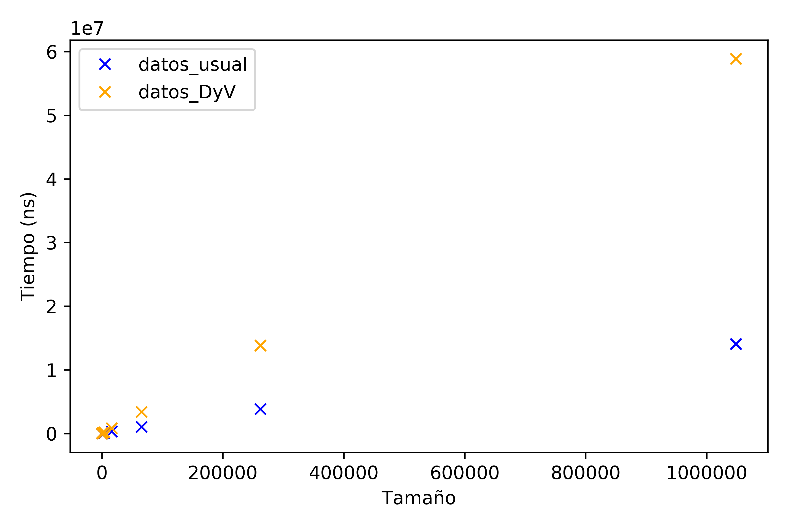
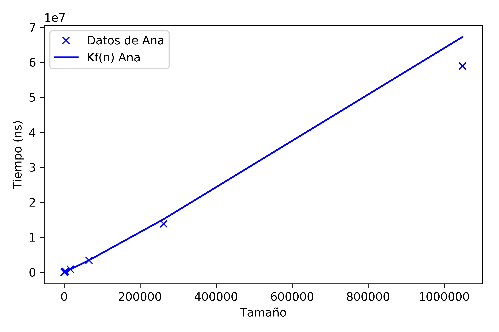

# Presentación grupal

Autores:

> Ana Buendía, Andrés Millán, Paula Villanueva, Juan Antonio Villegas


#### Especificaciones

| Persona      | CPU              | OS                   |
| ------------ | ---------------- | -------------------- |
| Ana          | i5-6200U 2.30GHz | Ubuntu 16.04 LTS     |
| Andrés       | i5-8250U 3.40GHz | Antergos 4-19.29 LTS |
| Paula        | i7-5600U 2.60GHz | Ubuntu 18.04 LTS     |
| Juan Antonio | i7-4500U 3.00GHz | Ubuntu 18.04 LTS     |


#### Objetivos

- Resolver dos problemas con la metodología Divide y Vencerás
- Exponer los tres tipos de eficiencia
- Mostrar cómo proceden los algoritmos


### Problema común: Traspuesta de una matriz

Dada una matriz  $A\in \mathcal{M}_{N\times M}(\mathbb{Z})$, con $N$ y $M$ números naturales potencia de 2, se trata de trasponer la matriz usando la técnica de divide y vencerás.

Para ello subdividimos la matriz en 4 partes y aprovechamos que, si

$$A=\Big(\begin{matrix}A_{11} & \vert & A_{12} \\ \hline A_{21} & \vert & A_{22}  \end{matrix}\Big)$$
Entonces $$A^t=\Big(\begin{matrix}A_{11}^t & \vert & A_{21}^t \\ \hline A_{12}^t & \vert & A_{22}^t  \end{matrix}\Big)$$

#### Código

```c++
void intercambiar(vector<vector<int>> & matriz, int fIniA, int cIniA, int fIniB, int cIniB, int dim) {
    for (size_t i = 0; i < dim ; i++) {
        for (size_t j = 0; j < dim; j++) {
            int aux = matriz[fIniA + i][cIniA + j];
            matriz[fIniA + i][cIniA + j] = matriz[fIniB + i][cIniB + j];
            matriz[fIniB + i][cIniB + j] = aux;
        }
    }
}

void trasponerDyV (vector<vector<int>> & matriz, int fInicio, int fFin, int cInicio, int cFin) {
    if (fInicio < fFin) {
        int fMedio = (fInicio + fFin)/2;
        int cMedio = (cInicio + cFin)/2;

        trasponerDyV(matriz, fInicio,    fMedio, cInicio,    cMedio);
        trasponerDyV(matriz, fInicio,    fMedio, cMedio + 1, cFin);
        trasponerDyV(matriz, fMedio + 1, fFin,   cInicio,    cMedio);
        trasponerDyV(matriz, fMedio + 1, fFin,   cMedio + 1, cFin);

        intercambiar(matriz, fMedio + 1, cInicio, fInicio, cMedio + 1, fFin - fMedio);
    }
}

void trasponer (vector<vector<int>> & matriz) {
    trasponerDyV (matriz, 0, matriz[0].size()-1, 0, matriz.size()-1);
}
```

Si tomamos un tamaño de 4x4, podemos ver claramente los pasos que se realizan en el algoritmo:


TODO seguir explicando

### Análisis teórico

Estudiar la eficiencia teórica de la función `trasponer` es equivalente a estudiar la eficiencia teórica de la función `trasponerDyV`. Suponiendo $n$ el número de datos de la matriz, primero debemos calcular la eficiencia teórica de la función `intercambiar`. Esta función únicamente intercambia los valores de dos de las submatrices, por lo que sólo necesita recorrer la cuarta parte de la matriz original. Es decir, $T(n)=a\frac{n}{4}$, siendo $a$ el tiempo que tarda en ejecutarse el bloque de código del bucle más interno. Por tanto, la función `intercambiar` es de orden $O(n)$.

Sabiendo esto, ahora planteamos el tiempo de ejecución de la función `trasponerDyV` como una recurrencia, llamamos $a$ al tiempo de ejecución de las 2 primeras líneas y $b$ a la constante asociada a la ejecución de `intercambiar`. Así, tenemos $T(n)=a+4T(\frac{n}{4})+nb$. Hacemos el cambio de variable $n=2^k$ y llamamos $t_k=T(2^k)$ por lo que se tiene la ecuación $t_k=4t_{k-2}+2^kb+a$, equivalentemente $t_{k+2}-4t_{k}=2^{k}b+a$. Procedemos a resolverla: 

Primero resolvemos la ecuación homogénea asociada $t_k=4t_{k-2}$. Su polinomio característico es $p(\lambda)=\lambda^2-4=(\lambda-2)(\lambda+2)$, por tanto la solución es $t_k^h=c_1 2^k +c_2 (-2)^k$. 

Para hallar una solución particular, como el término independiente de la ecuación es una constante y una expresión $2^kb$, siendo 2 raíz del polinomio, existe una solución particular $t_k^p=c_3k2^k+c_4$. Por tanto, la solución de la ecuación es $t_k=c_1 2^k +c_2 (-2)^k+c_3k2^k+c_4$, y deshaciendo el cambio de variable, vemos 	que la función es $O(n\log_2 n)$.

### Análisis empírico

Ejecutamos nuesto algoritmo de divide y vencerás para ciertos tamaños, y esto es lo que hemos obtenido:

| Tamaño  |Tiempo(ns)|
|---------|---------|
| 4       | 223 |
| 4       | 228 |
| 4       | 153 |
| 16      | 285 |
| 16      | 307 |
| 16      | 396 |
| 64      | 859 |
| 64      | 795 |
| 64      | 770 |
| 256     | 1999 |
| 256     | 1986 |
| 256     | 2000 |
| 1024    | 6104 |
| 1024    | 5879 |
| 1024    | 5631 |
| 4096    | 21042 |
| 4096    | 24889 |
| 4096    | 20987 |
| 16384   | 84201 |
| 16384   | 84271 |
| 16384   | 84461 |
| 65536   | 349184 |
| 65536   | 409262 |
| 65536   | 349582 |
| 262144  | 1518578 |
| 262144  | 1520674 |
| 262144  | 1463234 |
| 1048576 | 11564469 |
| 1048576 | 6562308 |
| 1048576 | 9213409 |

Enseñando los puntos en media, obtenemos el siguiente gráfico:

.

A la vez, hemos usado un algoritmo usual para crear la traspuesta:

```c++
void trasposicion_usual (vector<vector<int>> matriz, vector<vector<int>> & destino) {
    for (int i = 0; i < matriz[0].size(); ++i)
        for (int j = 0; j < matriz.size(); ++j)
            destino[j][i] = matriz[i][j];
}
```

Esta función genera los siguientes resultados:

| Tamaño  |Tiempo(ns)|
|---------|---------|
| 4       | 669   |
| 4       | 580   |
| 4       | 564   |
| 16      | 733   |
| 16      | 695   |
| 16      | 679   |
| 64      | 1199   |
| 64      | 1560   |
| 64      | 1067   |
| 256     | 1530   |
| 256     | 1607   |
| 256     | 1503   |
| 1024    | 5378   |
| 1024    | 5542   |
| 1024    | 5587   |
| 4096    | 11927   |
| 4096    | 12211   |
| 4096    | 12020   |
| 16384   | 51910   |
| 16384   | 71191   |
| 16384   | 54958   |
| 65536   | 214262   |
| 65536   | 218389   |
| 65536   | 215743   |
| 262144  | 1345798   |
| 262144  | 1021042   |
| 262144  | 1619368   |
| 1048576 | 4062939   |
| 1048576 | 3970055   |
| 1048576 | 4040784   |


Plasmamos ambas en la misma gráfica, y este es el resultado:




### Análisis empírico

Hacemos la regresión para nuestro algoritmo basado en Divide y Vencerás, y obtenemos lo siguiente:


FIXME

La funcion que ajusta la empirica con DyV $ax+b$, con $$a = 8.61866395$$$$b=-9.50365406 \cdot 10^{4}$$

La constante $k$ para DyV es $k = 3.14399$



Para el algoritmo usual, se ha obtenido lo siguiente:


---


## Problema asignado: Máximo y mínimo de un vector

Para resolver este problema, procederemos de la manera que sigue: Dividiremos el vector en dos partes y obtendremos el máximo (resp. mínimo) de cada subvector para después compararlos y devolver el máximo (resp. mínimo). Si el tamaño de los vectores está por encima del umbral, volveremos a aplicar el procedimiento.


#### Código

```c++
int maximo (vector<int> &flechita, int l, int r) {
    if (l<=r) {
        if (r - l <= 1) {
            if (flechita[l] < flechita[r])
                return flechita[r];
            else
                return flechita[l];
        }
        else {
            int m    = (l + r)/2;
            int maxL = maximo(flechita, l, m);
            int maxR = maximo(flechita, m + 1, r);

            if (maxL < maxR)
                return maxR;
            else
                return maxL;
        }
    }
}
```

```c++
int minimo (vector<int> &flechita, int l, int r) {
    if (l<=r) {
        if (r - l <= 1) {
            if (flechita[l] > flechita[r])
                return flechita[r];
            else
                return flechita[l];
        }

        else {
            int m    = (l + r)/2;
            int minL = minimo(flechita, l, m);
            int minR = minimo(flechita, m + 1, r);

            if (minL < minR)
                return minL;
            else
                return minR;
        }
    }
}
```

### Análisis teórico

Analizamos la eficiencia teórica de la función `maximo`, ya que la otra es análoga. La función es recursiva, luego necesitamos una ecuación de recurrencia para plantearlo. Si el tamaño del vector a buscar es 2 o menos, tenemos un bloque `if-else` cada uno con una sentencia de tiempo constante, luego este caso se puede acotar con una constante $a$. El caso en el que el tamaño sea mayor que 2, hay dos llamadas a la propia función pero el tamaño es de la mitad junto con un conjunto de sentencias que se pueden acotar por una constante $b$. Resumiendo:

$$T(n)=a \text{ si } n \leq 2$$
$$T(n)=T\Big(\frac{n}{2}\Big)+b \text{ si } n>2$$

Resolvamos la recurrencia. Para ello, hacemos el cambio de variable $n=2^k$, y denotamos $T(2^k)=t_k$. Entonces, la segunda ecuación quedaría como: $t_k=2t_{k-1}+b$. Resolvemos esta ecuación de recurrencia.

Primero calculamos la solución de la homogénea asociada: $t_{k+1}-2t_k=0$

La ecuación característica es $\lambda -2=0$, por lo que su única solución es $\lambda = 2$, por tanto la solución a la ecuación homogénea es: $t_k^h=c_1\cdot 2^k$ siendo $c_1$ una constante que depende del valor inicial.

Calculamos ahora una solución particular, que sería una solución constante, que denotamos por $t_k^p$. Se tiene que $t_k^p- 2t_k^p-b=0$, despejamos y nos queda $t_k^p=-\frac{b}{2}=c_2$, que denotaremos como $c_2$ porque es otra constante.

En conclusión: $t_k=t_k^h +t_k^p=c_1\cdot 2^k+c_2$, y deshaciendo el cambio de variable, obtenemos $T(n)=c_1\cdot n+c_2$. Observando la ecuación, concluimos que el algoritmo es de orden $O(n)$.


### Análisis empírico

Procederemos de forma similar a como se hizo en la anterior práctica. Vamos aumentando el problema del tamaño, y mostramos el tiempo de ejecución de la función.

Hemos obtenido, en media, los siguientes valores:

```
Peaso tabla loco
```