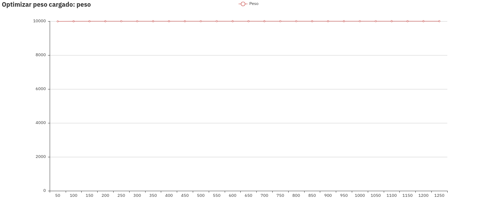
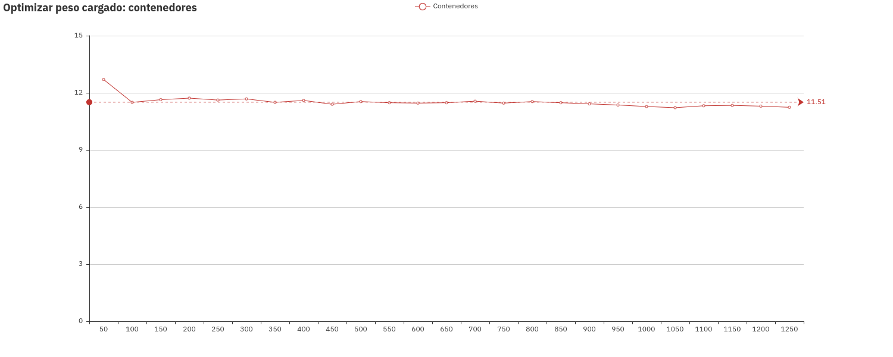
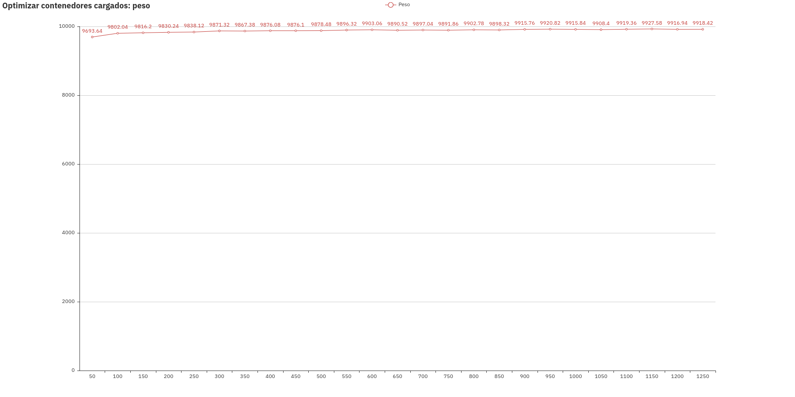
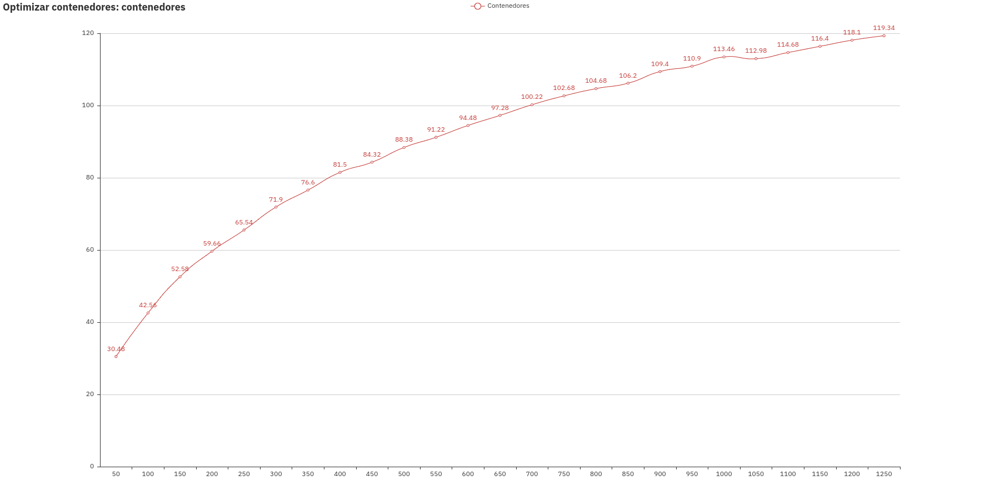

# Práctica 3. Algoritmos voraces
Grupo: Las Algas

> Ana Buendía, Andrés Millán, Paula Villanueva, Juan Antonio Villegas

---

## Objetivos
- Aprender a aplicar algoritmos voraces.
- Resolver el problema del Viajante de Comercio.
- Diseñar un algoritmo que maximice el número de contenedores cargados en un barco.
- Diseñar un algoritmo que maximice el peso cargado en un barco.

---

## Especificaciones

| Persona      | CPU               | OS                    |
|--------------|-------------------|-----------------------|
| Ana          | i5-6200U 2.30GHz  | Ubuntu 16.04 LTS      |
| Andrés       | i5-8250U 3.40GHz  | Antergos 4-19.42 LTS  |
| Paula        | i7-5600U 2.60GHz  | Ubuntu 18.04 LTS      |
| Juan Antonio | i7-4500U 3.00GHz  | Ubuntu 18.04 LTS      |

---

## Problema de los contenedores en un barco

---

### Estructura
```c++
struct Contenedor {
    string id;
    int peso;

    Contenedor(string i, int p) {
        id   = i;
        peso = p;
    }
};
```

```c++
typedef set<Contenedor, lex_compare> mySet;
```

---

### Enfoque Greedy

Trata de ir incluyendo los contenedores <u>menos</u> pesados hasta que no quepan más.
Los elementos que nos definen el enfoque Greedy son:

- **Conjunto de candidatos**: contenedores disponibles
- **Conjunto de candidatos ya usados**: contenedores incluidos en el barco
- **Función solución** que nos dice cuando un subconjunto de candidatos forma una solución
- **Criterio de factibilidad**: Un conjunto de contenedores es válido mientras que su peso total no exceda la carga máxima
- **Función de selección**: El siguiente candidato más prometedor es el siguiente contenedor menos pesado o más pesado
- **Función objetivo**: El objetivo es maximizar el número de contenedores o el peso cargado en el barco

---

### Máximizar los contenedores cargados

```c++
int cargaMaxContenedores (vector<Contenedor> &barco, mySet &contenedores) {
    int pesoTotal = 0;

    for (auto i = contenedores.begin(); i != contenedores.end()
                                        && pesoTotal + (*i).peso <= K; ++i) {

        barco.push_back(*i);
        pesoTotal += (*i).peso;
    }

    return pesoTotal;
}
```

---

#### Eficiencia teórica

$$T(n)=a+b\cdot n$$

El algoritmo es $O(n)$.

---

### Maximizar el peso cargado

```c++
int cargaMaxPeso (vector<Contenedor> &barco, mySet &contenedores) {
    int pesoTotal = 0;

    for (auto i = contenedores.rbegin(); i != contenedores.rend(); ++i) {
        if (pesoTotal + (*i).peso <= K) {
            barco.push_back(*i);
            pesoTotal += (*i).peso;
        }
    }

    return pesoTotal;
}
```

---

#### Eficiencia teórica

$$T(n)=a+b\cdot n$$

El algoritmo es $O(n)$.

---

### Eficiencia total

Tiempo del bucle:

$$\sum_{i=1}^{n}{\log_2(i)}$$

`$$\sum_{i=1}^{n}{\log_2(i)} \leq \sum_{i=1}^{n} {\log_2(n)}=n \cdot \log_2(n)$$`

Luego se tiene: $O(n\cdot \log_2(n))$

---

### Optimalidad de maximizar los contenedores cargados

- Supongamos que $S=\\{c_1,\dots,c_m\\}$ es la solución que devuelve nuestro algoritmo y $P_S=\\{p_1,\dots,p_m\\}$ son los pesos asociados.
- Supongamos que $S'=\\{c_1',\dots,c_k'\\}$ es otra solución más óptima, es decir, $k>m$.
- Consideramos el "*primer elemento que se quedó fuera de la solución del algoritmo*", es decir, el contenedor menos pesado que no forma parte de $S$, lo denotamos como $c$ y a su peso como $p_c$.

---

- Se demuestra por reducción al absurdo
- Tenemos que `$T=\{ c_1,\cdots,c_m,c'_{m+1},\cdots,c'_{k}\}$` es solución del problema.
- Por cómo hemos escogido $c$ tenemos $T'=\\{c_1,\cdots,c_m,c\\}$ es solución. Contradicción, si fuera solución nuestro algoritmo habría incluido $c$.
---

### Resultados gráficos

---

#### Procedimiento

Variamos la cantidad generada de contenedores $N$ y observamos cómo se comportan el peso y los contenedores cargados para ambos algoritmos

---

#### Optimizar peso cargado
##### Estudio del peso


---

#### Optimizar peso cargado
##### Estudio de los contenedores


---

#### Optimizar contenedores cargados
##### Estudio del peso


---

#### Optimizar contenedores cargados
##### Estudio de los contenedores


---

## Problema común: Problema del viajante de comercio

---

### Resolución por cercanía

Esta resolución se basa en dada una ciudad inicial la siguiente ciudad visitada será aquella que esté más cerca, y, una vez visitadas todas las ciudades, se vuelve a la ciudad de partida.

```c++

```

