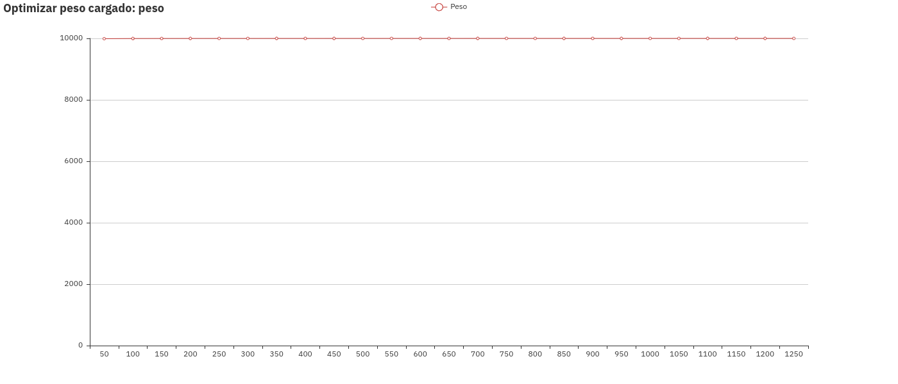

# Algoritmos voraces

## Las algas

> Ana Buendía, Andrés Millán, Paula Villanueva, Juan Antonio Villegas

#### Objetivos

* Aprender a aplicar algoritmos voraces.
* Resolver el problema del Viajante de Comercio de diferentes maneras.
* Diseñar un algoritmo que maximice el número de contenedores cargados en un barco.
* Diseñar un algoritmo que maximice el peso cargado en un barco.

## Problema común: El problema del viajante de comercio

Dado un conjunto de ciudades y una matriz con las distancias entre todas ellas, un viajante debe recorrer todas las ciudades exactamente una vez, regresando al punto de partida, de forma tal que la distancia recorrida sea mı́nima. Mas formalmente, dado un grafo $G$, conexo y ponderado, se trata de hallar el ciclo hamiltoniano de mı́nimo peso de ese grafo.

### Resolución por cercanía

Esta resolución se basa en dada una ciudad inicial la siguiente ciudad visitada será aquella que esté más cerca, y, una vez visitadas todas las ciudades, se vuelve a la ciudad de partida.

A continuación se adjunta función cercanía que hemos implementado:

```c++
int cercania (const vector<vector<int>> & adyacencia, vector<int> & resultados) {
    int n = adyacencia.size();
    int dist_min, dist = 0, i, j, aux;
    long suma_distancias = 0;

    resultados.resize(n);
    resultados[0] = 0;

    for (i=1; i<n; i++) {
        dist_min = INT_MAX;

        for (j=0; j<n; j++)
            if (find(resultados.begin(), resultados.end(), j) == resultados.end()) {
                dist = adyacencia[max(j, resultados[i-1])][min(j, resultados[i-1])];

                if (dist < dist_min) {
                    aux = j;
                    dist_min = dist;
                }
            }

        suma_distancias += dist_min;
        resultados[i] = aux;
    }

    suma_distancias += adyacencia[max(resultados[0], resultados[n-1])][min(resultados[0], resultados[n-1])];

    return suma_distancias;
}
```


### Resolución por inserción

Se parte de un recorrido que solo contiene algunas de las ciudades, en este caso, se cogen las tres ciudades que forman el triángulo más grande y se van añadiendo ciudades al circuito, por ejemplo la que menor incremento de la longitud del recorrido provoque.

La función implementada para esta resolución:

```c++
template <class T>
int insercion (const vector<T> &x, const vector<T> &y, const vector<vector<int>> & map, vector<int> & resultados) {
    int c0 = 1, c1 = 1, c2 = 1;

    for (int i = 0; i < x.size(); i++) {
        if(x[i] < x[c0])      c0 = i;
        if(x[i] > x[c1])      c1 = i;
        if(y[i] > y[c2])      c2 = i;
    }

    int n         = map.size();
    int distancia = 0;

    resultados.clear();
    resultados.push_back(c0);
    resultados.push_back(c1);
    resultados.push_back(c2);

    distancia += map[c0][c1];
    distancia += map[c1][c2];
    distancia += map[c2][c0];

    vector<int> candidatos;
    for (int i = 0; i<n; i++)
        if (i!=c0 && i!=c1 && i!=c2)
            candidatos.push_back(i);

    int nextCity, incrementoMin, incremento, posicion;

    while (candidatos.size() > 0) {
        nextCity      = candidatos[0];
        incrementoMin = INT_MAX;

        for (int i = 0; i < candidatos.size(); i++) {

            for(int j = 0; j < resultados.size(); j++) {
                //Calcular incremento si insertamos el candidato i en la posición j

                //Sumar la arista entre la ciudad en la posición j y el candidato +
                //la arista entre el candidato y la ciudad j+1
                //Restar la distancia entre el que está en la posición j y la j+1
                incremento = map[resultados[j]][candidatos[i]] +
                             map[candidatos[i]][resultados[(j+1)%resultados.size()]] -
                             map[resultados[j]][resultados[(j+1)%resultados.size()]];

                if (incremento < incrementoMin){
                    incrementoMin = incremento;
                    nextCity      = candidatos[i];
                    posicion      = j;
                }
            }
        }

        resultados.insert(resultados.begin()+posicion,nextCity);
        candidatos.erase(remove(candidatos.begin(),candidatos.end(),nextCity));
        distancia += incrementoMin;
    }

    return distancia;
}
```


### Algoritmo propio

Nuestro algoritmo se basa en, dada la ciudad inicial, ir visitando ciudades realizando barridos en altura y de izquierda a derecha de forma secuencial. En otras palabras, visita primero las ciudades con coordenada $y$ menor, y, en caso de haber dos ciudades con la misma altura, se visita primero aquella con coordenada $x$ menor. Esto puede visualizar como ir visitando las ciudades de abajo a arriba y de izquierda a derecha, regresando finalmente a la ciudad inicial.

Para ello el código utilizado ha sido:

```c++
template <class T>
long int barrido (vector<T> x, vector<T> y, const vector<vector<int>> &matriz_adyacencia, vector<int> &orden) {
    /*
        Hacemos un barrido de abajo hacia arriba, buscando las ciudades por orden de altura.
        Si hay varias ciudades donde coinciden la misma altura, se barre desde izquierda a derecha
    */
    size_t n = y.size();

    orden.resize(n);

    T aux;
    size_t posicion;

    for (size_t i = 0; i < n; i++)
        orden[i] = i;

    // Reordenar con respecto a y. La primera ciudad se deja fija
    for (size_t i = 1; i < n; i++) {
        for (size_t j = 1; j < n; j++) {
            if (y[i] < y[j]) {
                // Mantener la posición entre los 3 vectores
                aux   = y[i];
                y[i]  = y[j];
                y[j]  = aux;

                aux   = x[i];
                x[i]  = x[j];
                x[j]  = aux;

                posicion = orden[i];
                orden[i] = orden[j];
                orden[j] = posicion;
            }
        }
    }

    // Reordenar x aquellos que tengan la misma posición y
    size_t saved_iter;
    for (size_t iter = 1; iter < n - 1; iter++) {
        // Encontrar repetidos
        saved_iter = iter;

        while (iter < n-1 && y[iter] == y[iter+1])
            iter++;

        //Ordenar parcialmente
        for (size_t i = saved_iter; i <= iter; i++) {
            for (size_t j = saved_iter; j <= iter; j++) {
                if (x[i] < x[j]) {
                    // Mantener la posición entre los 3 vectores
                    aux   = y[i];
                    y[i]  = y[j];
                    y[j]  = aux;

                    aux   = x[i];
                    x[i]  = x[j];
                    x[j]  = aux;

                    posicion = orden[i];
                    orden[i] = orden[j];
                    orden[j] = posicion;
                }
            }
        }
    }

    long int distancia_total = 0;

    for (int i = 1; i < n; i++) {
        distancia_total += matriz_adyacencia[ orden[i] ][ orden[i-1] ];
    }

    distancia_total += matriz_adyacencia[ orden[0] ][ orden[n-1] ];

    return distancia_total;
}

```


## Problema asignado: Contenedores en un barco

Se tiene un buque mercante cuya capacidad de carga es de $K$ toneladas y un conjunto de contenedores  $c_1,\dots,c_n$ cuyos respectivos pesos son $p_1 , \dots , p_n$ (expresados también en toneladas). Teniendo en cuenta que la capacidad del buque es menor que la suma total de los pesos de los contenedores:
1. Diseñe un algoritmo que maximice el número de contenedores cargados, y demuestre su optimalidad.
2. Diseñe un algoritmo que intente maximizar el número de toneladas cargadas.

### Solución

Para solucionar este problema hemos empleado la clase `set` (que representa el concepto de conjunto matemático) de la librería `STL`, aprovechando que puede contener elementos ordenados bajo cierto criterio. Por ello, los distintos contenedores disponibles han sido almacenados en un `set` ordenados por su peso, facilitando así el tratar con ellos aprovechando el orden implícito.

Para tratar con los contenedores, hemos creado la siguiente estructura:

```c++
struct Contenedor {
    string id;
    int peso;

    Contenedor(string i, int p) {
        id   = i;
        peso = p;
    }
};
```

Donde `id` es el identificador del contenedor, del tipo $c_i,\; i=1,\dots,n$ que nos indica el enunciado y `peso` es la variable que define, tal y como su propio nombre indica, el peso del contenedor en toneladas.

Para que el `set` ordene elementos de tipo `Contenedor` hay que especificarle la función de ordenación que debe utilizar, para ello utilizamos un *funtor* de la siguiente manera:

```c++
struct lex_compare {
    bool operator() (const Contenedor& c1, const Contenedor& c2) const {
        return c1.peso < c2.peso;
    }
};
```

Y así, al declarar un elemento de la clase `set` indicando esta estructura y este predicado, obtendríamos un `set` de elementos tipo `Contenedor` que los ordena según el método descrito en `lex_compare`. Esto es, la declaración `set<Contenedor, lex_compare> contenedores;` nos daría el tipo de dato que buscamos. Por simplicidad y para hacer el código más legible, hemos hecho el siguiente alias:

```c++
typedef set<Contenedor, lex_compare> mySet;
```

Así, la declaración `mySet contenedores;` nos daría el mismo tipo de dato.

Creada esta estructura de datos, la función de creación de contenedores aleatorios es la siguiente:

```c++
void generarContenedores (mySet &contenedores, const size_t tamano, const int max) {
    std::mt19937 rng;
    rng.seed(std::random_device()());
    std::uniform_int_distribution<std::mt19937::result_type> dist(0,max);

    for (size_t i = 0; i < tamano; ++i){
        contenedores.insert(Contenedor("c"+to_string(i),dist(rng))) ;
    }

}
```

Lo que hace es rellenar el `contenedores` con `tamano` elementos (contenedores) de entre 0 y `max` toneladas de peso.

El valor de la constante de Masa Máxima Autorizada (MMA) $K​$ lo hemos definido como una variable global:

```c++
#define K 10000
```

El barco lo hemos representado como un vector de elementos `Contenedor` , para este caso usamos la clase `vector`, suponiendo que el orden en el que se ordenen no es relevante.

Sin más dilación, procedemos a mostrar las funciones que pedía el problema.

#### Función que maximiza el número de contenedores cargados

Al problema se le puede aplicar un enfoque **Greedy** muy claro: en resumidas cuentas, trataría de ir incluyendo los contenedores <u>menos</u> pesados hasta que no quepan más. Si entramos más en detalle, los elementos que nos definen el enfoque Greedy son:

* Un **conjunto de candidatos**: En este caso son los contenedores disponibles.
* Un **conjunto de candidatos ya usados**: Que son los contenedores que se van incluyendo en el barco.
* Una **función solución** que nos dice cuando un subconjunto de candidatos forma una solución: Un conjunto de contenedores es solución (óptima o no) cuando el peso ya almacenado en el barco no pueda albergar el siguiente contenedor más pequeño.
* Un **criterio de factibilidad**: Un conjunto de contenedores es válido mientras que su peso total no exceda la carga máxima. Observar que todos los contenedores son factibles mientras no se encuentre uno que no lo sea, y una vez se encuentra, todos los demás no son factibles.
* Una **función de selección**: El siguiente candidato más prometedor es el siguiente contenedor menos pesado.
* Una **función objetivo**: El objetivo es maximizar el número de contenedores en el barco.

Dicho esto, aplicado a nuestra implementación, presentamos el siguiente algoritmo:

```c++
int cargaMaxContenedores (vector<Contenedor> &barco, mySet &contenedores) {
    int pesoTotal = 0;

    for (auto i = contenedores.begin(); i != contenedores.end() && pesoTotal + (*i).peso <= K; ++i){
        barco.push_back(*i);
        pesoTotal += (*i).peso;
    }

    return pesoTotal;
}
```

Como vemos, y teniendo en cuenta las características del tipo de dato `set`, el algoritmo simplemente va subiendo los contenedores más pequeños al barco hasta que ya no cabe el siguiente. Paramos cuando llegamos a un contenedor que no cabe, ya que si ese no cabe, los siguientes que son aún más pesados tampoco lo harán.

El algoritmo de paso devuelve el peso total que ha conseguido almacenar siguiendo este criterio, aunque realmente no es relevante, pues lo que interesa maximizar es el número de contenedores (en nuestra implementación, maximizar `barco.size()`).

#### Función que maximiza el peso cargado

A este caso también se le puede aplicar un claro enfoque **Greedy**: trataría de ir incluyendo los contenedores <u>más</u> pesados hasta que no quepan más. Si entramos más en detalle, los elementos que nos definen el enfoque Greedy son:

- Un **conjunto de candidatos**: En este caso son los contenedores disponibles.
- Un **conjunto de candidatos ya usados**: Que son los contenedores que se van incluyendo en el barco.
- Una **función solución** que nos dice cuando un subconjunto de candidatos forma una solución: Un conjunto de contenedores es solución cuando no quepa ninguno de los contenedores restantes.
- Un **criterio de factibilidad**: Un conjunto de contenedores es válido mientras que su peso total no exceda la carga máxima, esto es, un contenedor es factible si al sumar su peso al peso ya almacenado no se excede la máxima carga.
- Una **función de selección**: El siguiente candidato más prometedor es el siguiente contenedor más pesado.
- Una **función objetivo**: El objetivo es maximizar el peso total del barco.

Aplicado a nuestra implementación, tenemos:

```c++
int cargaMaxPeso (vector<Contenedor> &barco, mySet &contenedores) {
    int pesoTotal = 0;

    for (auto i = contenedores.rbegin(); i != contenedores.rend(); ++i) {
        if (pesoTotal + (*i).peso <= K) {
            barco.push_back(*i);
            pesoTotal += (*i).peso;
        }
    }

    return pesoTotal;
}
```

Observar que en este caso se ha usado un iterador inverso, es decir, recorre el conjunto de contenedores del más pesado al menos pesado y carga todos los que caben hasta que no queda ninguno que pueda caber.

En este caso también devuelve el peso final con el que se ha cargado el barco, que es también el valor que debemos maximizar.

### Eficiencia

Estudiemos ahora la eficiencia teórica de los algoritmos diseñados. Consideramos que el tamaño del problema $n$ es el número de contenedores disponibles para ser montados independientemente del criterio.

#### Función que maximiza el número de contenedores cargados

La declaración de variables y el retorno se pueden acotar por una constante $a$.

En el peor de los casos podríamos montar todos los contenedores, por lo que el iterador recorrería todo el `set` incluyendo el contenedor en el barco. Así, como las inserciones en un vector son $O(1)$, se pueden acotar por una constante $b$ y hay que insertar los $n$ contenedores, obtenemos que

$$T(n)=a+b\cdot n$$

Por lo que podríamos concluir que el algoritmo es $O(n)$.

#### Función que maximiza el peso cargado

La declaración de variables y el retorno se pueden acotar por una constante $a$.

En el peor de los casos podríamos montar todos los contenedores, por lo que el iterador recorre todas las posiciones y ejecuta el bloque `if` en todos los casos. El contenido del bloque `if` es $O(1)$, por lo que se puede acotar por una constante $b$ y hay que insertar los $n$ contenedores, por tanto obtenemos que

$$T(n)=a+b\cdot n$$

Y de nuevo este algoritmo es $O(n)$.

#### Eficiencia total

Sin embargo, no podemos afirmar directamente que estos algoritmos son lineales, pues el insertar los contenedores en el `set` de manera ordenada supone un coste en la eficiencia, ya que la función `insert` del tipo de dato `set` no es $O(1)$, sino $O(\log_2(n))$. Por lo que si queremos ser del todo precisos, a la función $T(n)$ de los anteriores algoritmos habría que añadirle la asociada a la generación e inserción de los contenedores, la función `generarContenedores`.

Las tres primeras lineas son acotables por una constante $c$, estudiemos entonces el bucle. El bucle inserta una componente en el `set` de forma que cada inserción tiene un coste logaritmico con respecto al tamaño del `set` en ese momento, es decir, el tiempo de ejecución del bucle es $\sum_{i=1}^n \log_2(i)$. Si hacemos la siguiente acotación:

$\sum_{i=1}^n \log_2(i)\leq \sum_{i=1}^n \log_2(n)=n\cdot \log_2(n)$

Y concluimos que la función de generación de contenedores es $O(n\cdot\log_2(n))$.

Sabiendo esto, podemos entonces afirmar que, rigurosamente, nuestras funciones son $O(n\cdot \log_2(n))$.

### Optimalidad

Por último, demostraremos la optimalidad del primer problema, para ello, supongamos que $S=\{c_1,\dots,c_m\}$ es la solución que devuelve nuestro algoritmo y $P_S=\{p_1,\dots,p_m\}$ son los pesos asociados. Como el algoritmo va incluyendo elementos en el vector de menor a mayor peso, podemos afirmar que $p_i\leq p_j$ siempre que $i\leq j$. Ahora, razonaremos por reducción al absurdo. Supongamos que $S'=\{c_1',\dots,c_k'\}$ es otra solución más óptima que la calculada por el algoritmo, es decir, tiene más elementos, lo que implica $k>m$, y llamamos $P_{S'}=\{p'_1,\dots,p'_m\}$ A los pesos asociados. La optimalidad no cambiaría si cambiamos el orden de la solución, por lo que podemos suponer que las componentes de $S'$ están ordenadas, esto es, $p_i\leq p_j \forall i\leq j$.

Como hemos diseñado el algoritmo de forma que siempre se coja el más pequeño disponible, necesariamente $p_i\leq p_i'\ \forall i\in\{1,\dots,m\}$. Por lo que definimos $T=\{c_1,\dots,c_m,c_{m+1}'\dots c'_k\}$ es otra solución del problema, ya que cambiamos los $m$ primeros contenedores por otros con peso menor o igual a los originales. Consideramos ahora el "primer elemento que se quedó fuera de la solución del algoritmo", es decir, el contenedor menos pesado que no forma parte de $S$, este es $c'_{m+1}$ y lo denotamos como $c$ y a su peso como $p_c$. Por como hemos escogido los elementos sabemos que $p_c\leq c'_{m+i}\forall i\geq 2$ y, por tanto, tenemos que $p_c\leq\sum_{i=1}^{k-m}p'_{m+i}$, es decir, que $c$ es menos pesado que los elementos añadidos a $S$ para formar $\hat{S}$. Por lo que entonces definiendo $T'=\{c_1,\dots,c_m,c\}$ es solución, pero por definición de nuestro algoritmo, si $T'$ fuera solución, el propio algoritmo la habría incluido, (pues T' no es mas que S uniéndole el contenedor c) luego $T'$ sería una solución que supera la carga máxima, llegando así a contradicción y demostrando que nuestra solución $S$ es la solución óptima.

### Resultados

Hemos generado varios contenedores, de 50 en 50, y hemos ejecutado ambos algoritmos. Podremos analizar cómo se comportan las soluciones según los diferentes contenedores generados:


#### Maximizar peso cargado



En esta gráfica, vemos que si deseamos maximizar el peso, con pocos contenedores generados se consigue. La carga máxima soportada por el barco es de 10000KG.


Además, vemos que el número de contenedores necesarios se mantiene prácticamente constante. No importa apenas la cantidad generada.

#### Maximizar contenedores cargados


Podemos que si optimizamos el número de contenedores cargados, el peso de la carga no se acerca tanto al tope del barco. Además, varía más que el anterior


Lo más significativo se produce en la anterior gráfica.
Usando el algoritmo que le da más importancia a los contenedores cargados, observamos que el algoritmo se beneficia claramente de una mayor cantidad de contenedores generados. Esto es debido a que hay más probabilidades de encontrar contenedores con una masa menor.
