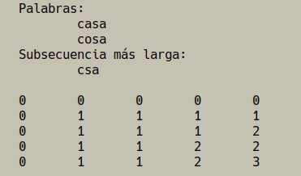

# Práctica 4. Programación dinámica
Grupo: Las Algas

> Ana Buendía, Andrés Millán, Paula Villanueva, Juan Antonio Villegas

---

## Objetivos

- Comprender el enfoque de la programación dinámica
- Identificar los elementos característicos en un problema concreto.
- Calcular la subsecuencia de caracteres común más larga dadas dos cadenas.
- Resolver dicho problema aplicando este método de programación

---

## Subsecuencia de caracteres más larga

### Enunciado

- Sean dos secuencias de caracteres $X= (x_1, x_2, \dots , x_m)$ e $Y= (y_1, y_2, \dots , y_n)$.
- Encontrar la máxima subsecuencia de caracteres común de izquierda a derecha (no necesariamente de forma contigua).

---

## Por qué aplicamos Programación Dinámica

- Los subproblemas comparten subproblemas.

- La matriz de costos nos ahorra operaciones repetidas.

- Se optiene la solución óptima.

---

## Método de la P.D.

- **Naturaleza N-etápica**.
- **Cumplimiento del POB**.
- **Ecuación de recurrencia**.
- **Encontrar la solución**.

---

### Ecuación recurrente
Sean $X[0..n]$ e $Y[0..m]$, entonces

$$LCS(X[0..n],Y[0..m])=\begin{cases}LCS(X[0..n-1],Y[0..m-1])+X[m-1] \quad\quad\quad\quad\quad\quad\quad\quad\quad \text{si }X[n-1]=Y[m-1] \\\max(LCS(X[0..n-1],Y[0..m]),LCS(X[0..n],Y[0..m-1])) \quad \text{  en otro caso}\end{cases}$$

---

### Código I

```py
cadena LCS (cadena X, cadena Y, entero m, entero n):
    si alguna cadena está vacía:
        devolver cadenavacía

    si coincide el último carácter:
        devolver LCS(X,Y,m-1,n-1) + último carácter

    si costos[m-1][n] >= costos[m][n-1]:
        devolver LCS(X,Y,m-1;n)

    si no:
        devolver LCS(X,Y,m,n-1)
```

---

### Código II

```py
LCS_coste (cadena X, cadena Y, entero m, entero n):
    para cada 0 <= i < m:
        para cada 0 <= j < n:
            si coincide el carácter:
                costos[i+1][j+1] = costos[i][j]+1

            si no:
                costos[i+1][j+1] = max( costos[i][j+1], costos[i+1][j] )
```

---

### Ejemplo I


---

### Ejemplo II



---

### Ejemplo III


---

### Conclusiones

- ¡Solución óptima de forma sencilla!

- Metodología similara a Divide y Vencerás en este problema.

---

### Problemas encontrados

- La recurrencia puede ser compleja si el tamaño de las cadenas es grande y tienen pocos elementos en común.

- Gran uso de recursos (memoria).
